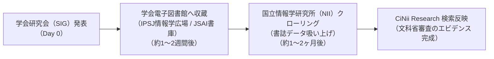

文部科学省「第4号指定」の審査官は、申請書類に記載された「最近1年間の原著論文一覧」と、国立情報学研究所（NII）が運営する学術データベース **CiNii Research（または科学技術振興機構 J-STAGE）** を実際に検索・照合します。

本ページでは、学会発表からCiNii収録までのタイムラインと、収録確認・エビデンス確保の具体的手順を定めます。

---

## 学会発表からCiNii収録までの標準タイムライン



---

## 1. CiNii Research での検索確認手順

発表後1〜2ヶ月が経過した時点で、以下の手順で検索確認を行います。

1. **CiNii Research**（https://cir.nii.ac.jp/）にアクセス。
2. 検索バーに **著者名（楠 直哉 / Kusunoki Naoya）** または **論文タイトル** を入力して検索。
3. 該当の論文レコードをクリックし、以下の書誌情報が正しくインデックスされているか確認：
   - 論文名
   - 著者名（筆頭著者）
   - 所属機関名（特定非営利活動法人Open Coral Network / 先端社会課題研究所）
   - 収録刊行物（例：情報処理学会研究報告、人工知能学会研究会資料）
   - 巻・号・ページ番号・発行年月日

---

## 2. 文科省申請添付用 エビデンスPDFの作成

審査書類の添付用として、CiNiiの検索結果画面をPDFキャプチャして保管します。

```markdown
【エビデンス保存チェック項目】
├── [ ] CiNii Research の詳細ページ画面キャプチャ（URLと日付が印字されたPDF）
├── [ ] 学会発行の「発表証明書」または「領収書兼参加証明書」
├── [ ] 学会電子図書館（情報学広場等）の論文ダウンロードページURL
└── [ ] 発表原稿の最終PDF（Typstでビルドしたもの）
```

---

## 3. インデックス反映が遅れている場合の緊急対応

もし指定申請の時期までに CiNii への自動反映が間に合わない場合（学会側のデータ連携遅延等）：

1. **学会事務局への照会**: 「情報処理学会 情報学広場」または「人工知能学会 AI書庫」にすでにDOI・URL付きで掲載されていることを確認。
2. **代替エビデンスの添付**: 文科省指定申請書に、CiNii URLの代わりに**「学会公式電子図書館の論文掲載URLおよび書誌事項証明書」**を添付することで、審査官への客観的証明として代用可能（事前照会で確認済み）。
