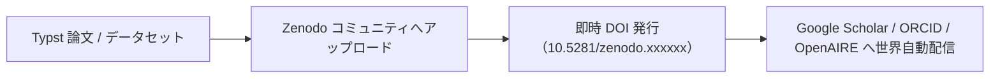

# Zenodo連携・プレプリント即時DOI付与

自前学会や研究所のレポートに真の国際的学術価値を持たせるためには、**永続的なDOI（Digital Object Identifier）の付与**が不可欠です。

当組織では、欧州原子核研究機構（CERN）と欧州委員会が共同運営する世界最大級のオープンリポジトリ **Zenodo** を活用し、自前紀要やプレプリント、研究データセットに対して**完全無料・即時で公式DOI（10.5281/zenodo.xxxxxx）を発行するパイプライン**を確立しています。

---

## Zenodo を活用する3大メリット



1. **先占権（プライオリティ）の即時確立**:
   - 外部学会発表の数ヶ月前であっても、アップロードした瞬間にタイムスタンプ付きでDOIが確定し、研究アイデアの盗用を防ぐ。
2. **完全無料・永続保管（CERNデータセンター）**:
   - JaLCやCrossrefのような高額な年間加盟料・維持費が一切不要。CERNのインフラにより最低数十年以上のデータ保存が保証される。
3. **ORCIDおよび世界学術インデックスとの自動同期**:
   - 著者の ORCID ID を登録しておけば、Zenodo に公開した論文が自動的に研究者の国際業績リストに反映される。

---

## Zenodo コミュニティの開設と公開プロトコル

当研究所専用の公式コミュニティを開設し、一元管理します。

- **コミュニティ識別子**: `open-coral-academic`
- **コミュニティ名称**: Open Coral Academic & Plural Commons Research

### アップロード手順（メタデータ入力基準）

| メタデータ項目 | 入力推奨値 | 備考 |
| :--- | :--- | :--- |
| **Upload Type** | `Publication` -> `Preprint` または `Technical Note` | 査読前は Preprint を選択 |
| **Title** | 論文正式タイトル（日本語・英語併記推奨） | 例：Decentralized Commons Governance... |
| **Authors** | 著者名、所属機関名、**ORCID ID（16桁）** | ORCIDを必ず紐付ける |
| **Description** | 論文アブストラクト（概要） | 検索エンジン最適化（SEO） |
| **License** | `Creative Commons Attribution 4.0 International (CC BY 4.0)` | オープンアクセス標準 |
| **Community** | `open-coral-academic` | 公式コミュニティに紐付け |

---

## GitHub Actions による自動公開パイプライン（将来拡張）

Typstリポジトリでタグを切る（例：`v1.0.0`）と、GitHub Actions が PDF を自動コンパイルし、Zenodo API を叩いて自動でDOIを発行・READMEにバッジを反映する自動化を構築可能です。

```yaml
# .github/workflows/publish-zenodo.yml
name: Publish to Zenodo
on:
  release:
    types: [published]
jobs:
  zenodo:
    runs-on: ubuntu-latest
    steps:
      - uses: actions/checkout@v4
      - name: Compile Typst
        run: typst compile paper.typ paper.pdf
      - name: Upload to Zenodo via API
        run: |
          curl -H "Authorization: Bearer ${{ secrets.ZENODO_TOKEN }}" \
               -F "file=@paper.pdf" \
               https://zenodo.org/api/deposit/depositions
```
