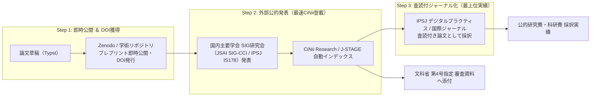

文部科学省「第4号指定」の審査において最も厳格に見られるのが**「最近1年間の原著論文実績」**です。

自前で立ち上げた学会や紀要のみで発表実績を作ろうとすると、**「第三者による客観的なピアレビュー（査読・第三者性）が欠如した身内の自作自演」**と判断され、審査で却下される重大リスクがあります。

これを確実に回避するため、当組織では**「既存学会の研究会（SIG）で公的実績を担保しつつ、自前リポジトリで即時オープンアクセス化するハイブリッド出版戦略」**を採用します。

---

## 自前紀要の落とし穴とハイブリッド戦略の比較

| 項目 | 自前学会の紀要のみの場合（リスク大） | ハイブリッド出版戦略（当研究所の標準方針） |
| :--- | :--- | :--- |
| **客観的評価** | ❌ 身内審査とみなされ公的信用が低い | ⭕ 伝統ある全国学会（JSAI/IPSJ等）の公式発表として高い信用 |
| **CiNii収録** | ❌ データベース連携に1〜2年以上の審査期間が必要 | ⭕ 学会の公式書誌システム（情報学広場/AI書庫）経由で**即自動連携** |
| **所要期間** | ❌ 紀要の創刊・発行までに莫大な工数 | ⭕ 研究会（SIG）申込から発表まで**2〜3ヶ月で完結** |
| **知財・公開速度** | △ 発行まで非公開のまま | ⭕ 執筆直後に **Zenodo / arXiv でプレプリント即時公開・DOI付与** |

---

## 3段階ハイブリッド・パイプライン

---

## 各段階の役割分担

### 1. プレプリント即時公開（先占権・オープンアクセス）
- 論文ドラフトが完成した段階で、欧州CERN運営の学術リポジトリ **Zenodo** にアップロード。
- 即時に国際永続識別子（DOI）が付与され、研究アイデアの先占権（プライオリティ）を世界基準で確定。

### 2. 国内学会研究会（SIG）発表（公的第三者証明）
- 人工知能学会（JSAI SIG-CCI）や情報処理学会（IPSJ IS178）の研究会で発表。
- 学会公式の研究報告集に採録され、学会の電子図書館を通じて **CiNii Research に公式インデックス**される。
- これにより、文科省審査官が「CiNiiで検索して確認できる客観的学術実績」が最速で完成する。

### 3. 査読付きジャーナル論文への昇格（最高峰の信頼性）
- 研究会でのフィードバックや追加データを反映し、実践知を重視する**情報処理学会「デジタルプラクティス」**や国際ジャーナルへ投稿。
- 査読付き原著論文として採録され、科研費や大型助成金申請において圧倒的な競争力を獲得する。
