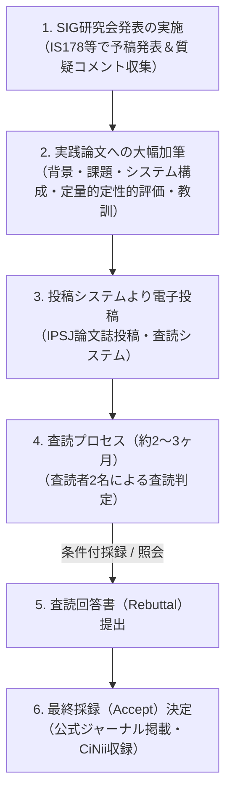

# 査読付実践論文誌「デジタルプラクティス」投稿戦略

研究会（SIG）での発表によって文科省第4号指定の要件をクリアした後、科研費の採択率や大型助成金の獲得力を最大化するために目指すべき最高峰の実績が、**「査読付き原著論文（Peer-Reviewed Journal）」の採択**です。

当研究所では、伝統的な学術理論だけでなく「社会実装の実践知・試行錯誤のプロセス」を正面から評価する、一般社団法人 情報処理学会の査読付き論文誌 **『デジタルプラクティス（Digital Practice）』** をターゲットジャーナルとして位置付けています。

---

## なぜ「デジタルプラクティス」が最適なのか？

| 比較項目 | 一般の学術論文誌（Transactions） | デジタルプラクティス（実践論文） |
| :--- | :--- | :--- |
| **評価軸** | 数理的厳密性・理論的新規性 | **有用性・実践知・社会実装の再現性** |
| **会員資格** | 著者に正会員が必須の場合が多い | **非会員でも投稿・掲載可能** |
| **論文形式** | 理論モデルの証明やベンチマーク比較 | **システム構築事例、自治体実証、失敗から得た教訓** |
| **公的実績価値** | 査読付き原著論文（最高ランク） | **査読付き原著論文（同等の公的価値）** |
| **CiNii / J-STAGE** | 登載 | **登載（DOI付与・オープンアクセス）** |

> [!TIP]
> NPO法人の現場活動、空き家再生でのAI見守り実験、自治体オープンデータ活用、コミュニティガバナンスの実践知は、通常の理論論文誌では「理論的新規性に乏しい」とリジェクトされやすい一方、**デジタルプラクティスでは「現場の泥臭い実践と知見」として極めて高く評価**されます。

---

## 投稿から採否決定までの標準プロセス

---

## 査読を突破するための構成フレームワーク

デジタルプラクティスで高く評価される論文構成テンプレート：

1. **背景と課題提起**:
   - なぜ既存のシステムや市販ツールでは、地方自治体や現場NPOの課題を解決できなかったのか？
2. **システムアーキテクチャ ＆ 運用設計**:
   - Nexloom / Auto-Grants / Civic AI エージェントの具現化設計
3. **現場での実践展開（実証実験）**:
   - 富山県等における具体的な利用実績、定量的データ（合意形成期間の短縮、参加者数等）
4. **得られた知見と教訓（Lessons Learned）**:
   - 机上の空論では見えなかった「住民のITリテラシーの壁」「運用上のボトルネック」と、それをどう克服したか
5. **今後の汎用性と波及効果**:
   - 全国の他地域やNPOにどう応用可能か
