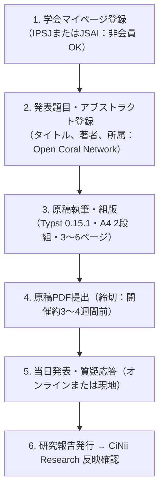

# 推奨外部学会・研究会（SIG）徹底比較

文科省審査官が参照する「客観的学術実績（CiNiiインデックス）」を最短で構築するため、NPO法人・実践者が発表しやすい国内学会の研究会（SIG）を徹底調査・比較しました。

---

## 総合比較ランキング

| 順位 | 学会・研究会名 | 非会員発表 | 参加費目安 | CiNii収録 | テーマ適合性 | 総合評価 |
| :---: | :--- | :---: | :---: | :---: | :---: | :---: |
| 🥇 | **人工知能学会（JSAI）SIG-CCI（市民共創知）** | ✅ 可能 | **無料** | ○（AI書庫経由） | ◎ シビックテック・合意形成・地域AI | ⭐⭐⭐⭐⭐ |
| 🥈 | **情報処理学会（IPSJ）IS研究会（情報システムと社会環境）** | ✅ 可能 | 約3〜4千円 | ○（情報学広場経由） | ○ 電子政府・社会システム・社会基盤 | ⭐⭐⭐⭐ |
| 🥉 | **電子情報通信学会（IEICE）SITE研究会** | ✅ 可能 | 5,500円 | ○（技報収録） | ○ 情報倫理・技術の社会受容 | ⭐⭐⭐⭐ |
| 4 | **情報処理学会（IPSJ）EIP研究会（知的財産・社会基盤）** | ✅ 可能 | 約3〜4千円 | ○（情報学広場経由） | ○ データガバナンス・知財 | ⭐⭐⭐☆ |
| 5 | **情報処理学会「デジタルプラクティス」（論文誌）** | ✅ 可能 | 掲載料あり | ◎（査読付論文） | ○ 実装知・現場事例を重視 | ⭐⭐⭐☆ |

---

## 第1推奨：人工知能学会 SIG-CCI（市民共創知研究会）

> [!TIP]
> **NPO法人にとって最も参入障壁が低く、テーマ適合性も抜群のベストチョイス。**

- **学会**: 一般社団法人 人工知能学会（JSAI）
- **対象テーマ**: シビックテック、オープンデータ、集合知、合意形成支援、地域課題×AI
- **非会員発表**: **可能（会員・非会員を問わず自由に参加・発表可能）**
- **参加費**: **無料**
- **CiNii収録**: 人工知能学会「AI書庫」を通じて CiNii Research に自動連携
- **特徴**: アカデミアだけでなく、自治体職員、NPO実務者、シビックエンジニアの現場実践報告が極めて温かく歓迎される土壌がある。

---

## 第2推奨：情報処理学会 IS研究会（情報システムと社会環境）

- **学会**: 一般社団法人 情報処理学会（IPSJ）
- **対象テーマ**: 情報システムの社会的影響、電子自治体、コモンズ、デジタルガバナンス
- **非会員発表**: **可能**（IPSJマイページ作成により非会員でも講演申込可能）
- **参加費**: 非会員一般 約3,300〜4,000円（税込）
- **CiNii収録**: 情報処理学会「情報学広場」を通じて CiNii Research に確実収録
- **直近ターゲット**: **第178回研究会（2026年12月5日・多摩大学）**
- **特徴**: 「論文執筆サポートセッション」が設けられており、アカデミア初心者のNPO実務者に対しても丁寧な査読・コメントが提供される。

---

## 発表申込から発表当日の標準フロー

