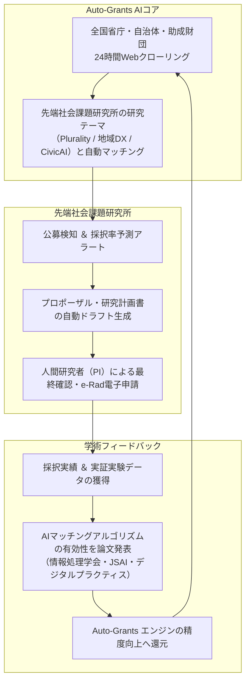

Open Coral Network が開発・運用する**「助成金・公募プロポーザルAI（Auto-Grants）」**と、先端社会課題研究所は、相互に価値を高め合う**「技術開発 ✕ 学術研究 ✕ 資金調達の完全内部循環ループ」**を形成しています。

研究所は外部の資金検索ポータルに依存せず、自社のAIエンジンを活用して全国・世界の公的研究開発資金を自律的に獲得します。

---

## 内部循環ループのメカニズム

---

## 研究所における Auto-Grants の活用ユースケース

1. **公募開始の即時検知（リードタイムの最大化）**:
   - 総務省SCOPE、経産省SBIR、文科省科研費、JST、民間助成金（トヨタ財団等）の公募要領が発表された当日にSlack/Nexloomへ通知。
   - 締切までの準備期間を通常より2〜3週間長く確保。
2. **要件適合性（Eligiblity）の瞬間判定**:
   - 「NPO法人応募可」「大学・学術機関連携要」「上限金額・間接経費率」などの公募要件をLLMが瞬時に精査し、無駄な応募工数をゼロ化。
3. **過去採択課題の分析による採択率向上**:
   - 過去数年分の採択タイトル・審査講評をベクトル検索し、審査員に最も響くキーワード・仮説設定をプロポーザルに自動反映。
4. **Auto-Grants 自身を学術研究の対象とする論文発表**:
   - 「LLMとオントロジーを用いた行政公募要領のゼロハルシネーション抽出手法」等のテーマで情報処理学会等へ論文投稿し、事業の学術的権威を確立。
