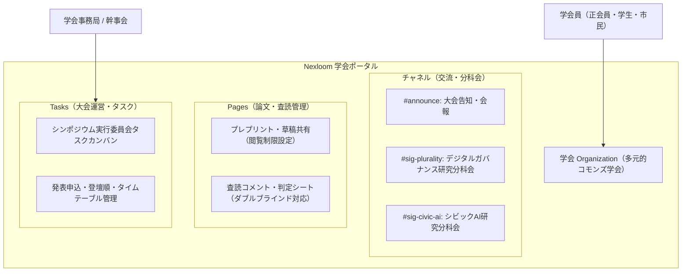

オープン学術研究会（学会）の運営基盤には、当組織のコアプロダクトである**統合ワークスペース「Nexloom（ai-note-meet）」**を全面的に採用しています。

外部の高額な学会管理システム（Smoosy等）や専用ポータルを契約することなく、チャット、ドキュメント（Pages）、タスク管理、AI会議要約、およびStripe決済を1つの基盤で統合運用します。

---

## Nexloom による学会運営アーキテクチャ

---

## 1. 会員管理と会費決済（Stripe連携）

- **入会フロー**:
  - 公式Webから入会申請 → Nexloomアカウント発行（正会員・学生会員ロール付与）。
  - Stripe Billing による年会費（正会員8,000円/学生2,000円）の自動継続課金。
- **権限管理**:
  - コミュニティ会員（無料）：オープンチャネルの閲覧・発言のみ。
  - 正会員・学生会員：専門研究会、論文投稿フォルダー、査読議論ルームへのフルアクセス権限。

---

## 2. オンライン査読（Peer Review）パイプライン

Nexloom の Pages 機能およびタスク連携を活用し、セキュアな査読プロセスを実行します。

1. **投稿受付**: 著者が匿名化された論文PDFを投稿専用フォルダーに格納。
2. **査読タスク自動アサイン**: プログラム委員長が、外部査読者2名に査読タスク（締切：3週間）を発行。
3. **査読コメントの集約**: 査読者は Nexloom Page 上で判定（採録 / 条件付採録 / 不採録）とコメントを記入。
4. **結果通知**: 事務局が判定結果を著者に通知（AI議事録・要約エージェントによるコメント整理活用）。

---

## 3. 年次シンポジウム・定期研究会の配信・記録

- **ハイブリッド開催**: 富山拠点（現地参加）と Nexloom ビデオ会議（オンライン参加）をリアルタイム接続。
- **AI会議要約（Nexloom Core）**: 発表セッションの音声から、質疑応答・重要論点・次回アクションをAIが自動抽出し、全会員へ議事録ページとして即日共有。
