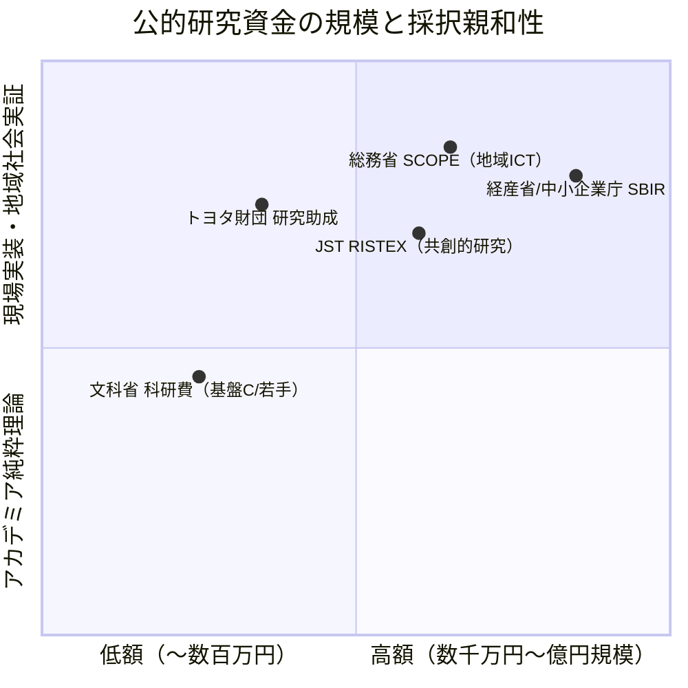

先端社会課題研究所では、獲得金額が年間数十万〜数百万円規模にとどまる科研費だけでなく、**e-Rad（府省共通研究開発管理システム）への法人一般登録によって応募可能となる、各省庁の大規模な研究開発資金**を積極的に獲得するポートフォリオ戦略を展開します。

---

## 狙うべき主要公的研究資金の比較マップ

---

## 1. 総務省 SCOPE（戦略的情報通信研究開発推進事業）

- **親和性**: **最高（NPO法人・シビックテックに最も適した大型公的資金）**
- **対象領域**: ICTによる地域課題解決、自治体データ連携基盤、デジタルコミュニティ
- **支援規模**: 年間 **500万円〜2,000万円**（最長3年間）
- **応募要件**: e-Rad登録機関（NPO法人単独または大学との共同研究体で応募可能）
- **当研究所の強み**: 富山拠点における空き家再生×見守りセンサー×AI対話エージェントの実証実験が、SCOPEの「地域課題解決型」枠に完全合致。

---

## 2. 経産省・中小企業庁 SBIR（イノベーション創出推進事業）

- **支援規模**: フェーズ1（概念実証・PoC）で **数千万円**、フェーズ2（実用化実証）で **数億円規模**
- **対象領域**: 生成AIを活用した行政業務DX、自治体オープンデータ活用、社会課題解決型スタートアップ・ソーシャル企業
- **当研究所の強み**: Auto-Grants や Nexloom による行政・NPO業務自動化の実装知を「ディープテック・ソーシャルイノベーション」として提案。

---

## 3. JST RISTEX（社会技術研究開発センター）

- **プログラム名**: 「科学技術イノベーションによる地域課題解決」「SDGsの達成に向けた共創的研究開発」
- **支援規模**: 年間 **1,000万円〜3,000万円**（3年間）
- **特徴**: 大学の研究者と現場の実践者（NPO・自治体・市民）が対等なパートナーとして共同提案することを必須要件とする。
- **当研究所の強み**: スリランカ大学教授や国内提携大学と、当研究所（NPO現場）が強固にスクラムを組むことで、RISTEXの審査基準で最も高い評価（現場性・学術性の両立）を獲得できる。
