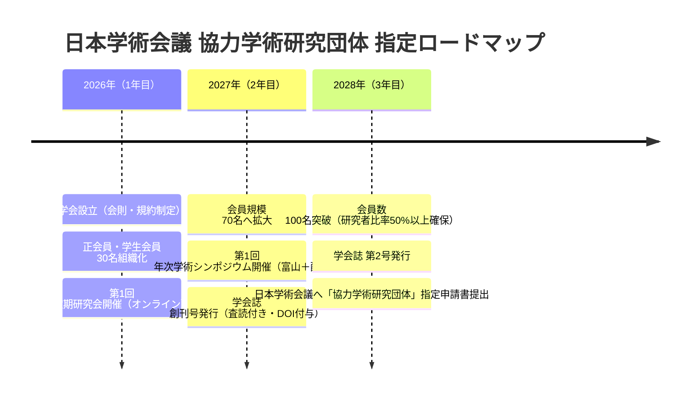

日本において、任意団体である学会が**「国家的に公認された正式な学術学会」**としての社会的認知と学術的権威を確立するための最高峰の登竜門が、内閣府・日本学術会議（Science Council of Japan: SCJ）による**「協力学術研究団体」の指定**です。

当学会（多元的コモンズ学会）では、設立から3年を目処に本指定の取得を目指し、段階的に会員規模・学術実績を拡充します。

---

## 日本学術会議 協力学術研究団体の指定要件

日本学術会議会則に基づき、以下の基準をすべて満たす必要があります。

| 要件項目 | 公式指定要件 | 当学会の達成アプローチ |
| :--- | :--- | :--- |
| **1. 目的と活動** | 学術研究の向上発達を図ることを主たる目的とすること | 会則第2条におけるPluralityおよびコモンズ学術研究の明記 |
| **2. 会員規模** | **構成員（会員）数が100名以上**であること | Nexloomを活用したコミュニティ連携、若手研究者・大学院生の組織化 |
| **3. 研究者比率** | 会員の過半数が大学教員・研究員等の研究者であること | 国内外の客員フェロー、提携大学教員、博士課程学生の重点招聘 |
| **4. 定期刊行物** | **年1回以上、学術定期刊行物（学会誌・紀要）を発行**していること | Zenodo/JaLC経由での学会誌（電子ジャーナル）年次発行・DOI付与 |
| **5. 大会・研究会** | **年1回以上、学術研究発表大会を開催**していること | 富山サードプレイス拠点とオンラインによるハイブリッド年次シンポジウム |

---

## 3カ年マイルストーン計画

---

## 指定取得による波及効果

1. **科研費「審査委員候補者」の推薦権**: 日本学術会議を通じて、国の科研費審査委員の候補者を推薦する公的権利を獲得。
2. **大学・研究機関での公認学会アフィリエーション**: 大学教員や大学院生が業績書（履歴書）に「所属学会」として正式記載可能となり、研究者の参画動機が飛躍的に向上。
3. **政策提言（Policy Recommendations）の公的チャネル**: 内閣府・デジタル庁・総務省に対する、シビックテクノロジーや多元型コモンズに関する学術的政策提言の公式ルートが開通。
