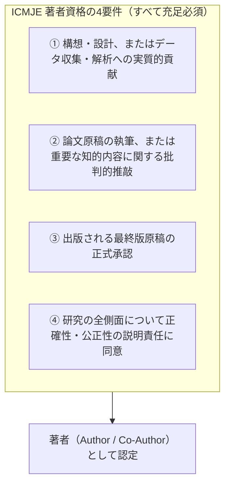
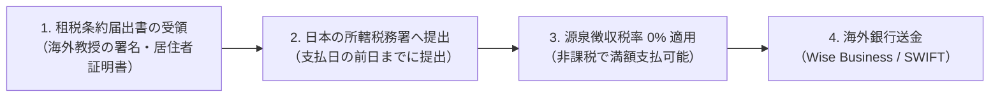

海外の客員上席研究員（スリランカ大学教授等）との学術連携において、研究倫理、論文オーサーシップ、データ管理、および資金決済で生じる法的・税務的トラブルを未然に防ぐための実務プロトコルです。

---

## 1. 国際論文共著ガイドライン（ICMJE基準準拠）

共同執筆する論文において、著者のクレジット（オーサーシップ）を巡る争いを防ぐため、**国際医学雑誌編集者委員会（ICMJE）の4要件**を厳格に適用します。



### 筆頭著者（First Author）と責任著者（Corresponding Author）の決定ルール
1. **筆頭著者（First Author）**: 実際に実験を行い、論文初稿の過半を執筆した者（当研究所の研究員または海外共同研究者）。
2. **連絡責任著者（Corresponding Author）**: 査読者とのやり取り、論文掲載料の支払いを統括する者（公的研究費の直接経費から支払う場合は、当研究所長・楠直哉が担当）。
3. **ギフトオーサーシップの禁止**: 単に研究資金を提供しただけ、あるいは所属部門の長であることのみを理由に共著者に加える行為は、研究不正として固く禁じます。

---

## 2. データ移転合意（Data Transfer Agreement: DTA / MTA）

日本側で収集した市民データやAIプログラムを海外共同研究者に提供する際、以下のデータ移転合意書を取り交わします。

```markdown
【国際データ移転（DTA）の基本条項】
1. 提供データ: 完全に匿名化（k>=5）された集計データセットまたはオープンソースコード
2. 目的外利用の禁止: 本共同研究プロジェクト以外の商用目的・第三者提供の禁止
3. 安全管理義務: パスワード暗号化ストレージへの保管および共有アカウントアクセスの制限
4. 研究終了後の措置: プロジェクト完了後、合意に基づき安全に消去または公的アーカイブ（Zenodo）へ移行
```

---

## 3. 海外フェローへの謝金送金 ＆ 租税条約（源泉徴収免除）

海外在住の客員研究員（非居住者）へ日本から謝金や研究費を支払う場合、所得税法上、**原則として一律 20.42% の源泉徴収**が義務付けられています。

しかし、日本とスリランカの間には**「日・スリランカ租税条約」**が締結されており、事前に所轄税務署へ届け出ることで、**源泉徴収税率を 0%（完全免除）**にすることができます。



### 租税条約免除の手続きステップ
1. **様式入手**: 国税庁「租税条約に関する届出書（教授等・研究者・原稿料等に関する届出書 / 様式7または様式8）」を準備。
2. **海外教授による記入・署名**: スリランカの居住地住所、納税者番号（TIN）、サインを受領。
3. **所轄税務署への提出**: 支払期日の前日までに、Open Coral Network の納税地所轄税務署へ2部提出（1部控え受領）。
4. **送金手段**:
   - **Wise Business**: 最安の手数料と最速の着金（推奨）。
   - **国際SWIFT送金**: 指定の銀行口座（SWIFT/BICコード、IBAN、受取人名義英字完全一致）宛に送金。
   - 送金エビデンス（外為送金計算書）は公的研究費管理監査室にて10年間保管する。
