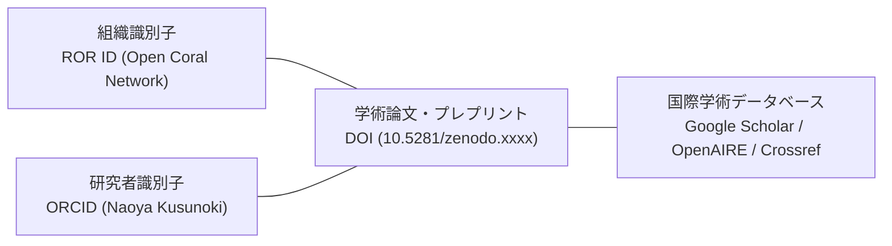

海外の大学、国際学術ジャーナル（Nature、Elsevier、Springer等）、および国際助成財団から**「正式な国際研究機関」**として認識・検証されるため、世界標準のデジタル識別子（Persistent Identifiers: PID）を取得・運用しています。

---

## 1. ROR（Research Organization Registry: 国際研究組織レジストリ）

RORは、ハーバード大学、CERN、Crossref、DataCite等が共同運営する、世界中の研究機関を一意に特定するためのオープンレジストリです。

- **登録申請名称**: `Specified Nonprofit Corporation Open Coral Network`
- **附置研究部門**: `Advanced Social Challenge Research Institute (ASCRI)`
- **国・所在地**: Japan / Toyama & Tokyo
- **組織種別**: `Nonprofit` / `Facility`
- **公式Web**: `https://coral-network.com`
- **ROR登録のメリット**:
  - 国際ジャーナル投稿システム（Editorial Manager, ScholarOne等）で組織名を検索した際、公式研究機関として自動サジェストされる。
  - 論文採録時に、所属機関として正式に世界共通ID（ROR ID）が自動タグ付けされる。

---

## 2. ORCID（Open Researcher and Contributor ID: 国際研究者ID）

研究者個人の業績・所属・査読実績を世界共通の16桁コードで永続管理する国際標準IDです。

- **所長・首席研究員 ORCID**: 楠 直哉（Naoya Kusunoki）
  - **アフィリエーション**: Director, Advanced Social Challenge Research Institute, Open Coral Network
- **運用ルール**:
  - 当研究所から発表されるすべての論文、学会予稿、プレプリント（Zenodo）には、著者のORCIDを必ず併記する。
  - 科研費電子申請システム（e-Rad）および科研費応募調書においても、ORCIDを連携・明記する。

---

## 3. 国際識別子の相互連携エコシステム

