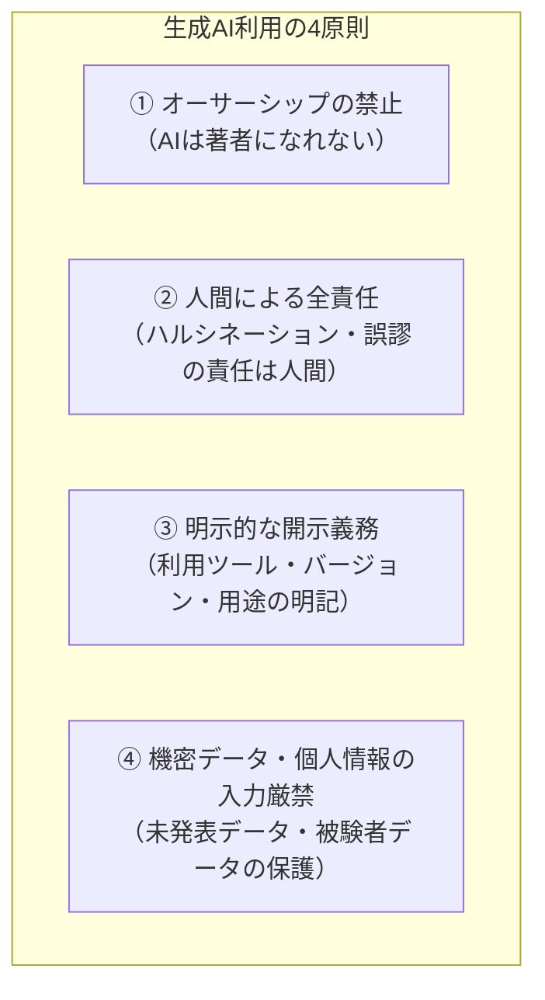

# 学術研究における生成AI利活用および開示に関する倫理ガイドライン

大規模言語モデル（LLM）や生成AIツールは、研究の生産性を飛躍的に高める一方、著作権侵害、未発表データの漏洩、ハルシネーション（幻覚）による研究不正、およびオーサーシップ（著作者責任）の曖昧化といった重大なリスクを孕んでいます。

当研究所では、人工知能学会（JSAI）、情報処理学会（IPSJ）、および国際出版倫理委員会（COPE）の最新基準に準拠し、研究活動における生成AIの利用基準を定めます。

---

## 4大利用原則



---

## 1. オーサーシップ（著作者資格）に関する厳格な禁止

- **AIツールの著者指定禁止**: ChatGPT、Claude、Gemini等のAIツールを、学術論文、研究報告、特許出願の「著者（Author）」または「共同著者（Co-Author）」として記載することは**一切認められません**。
- **理由**: 著作権法上、AIは権利能力を持たず、研究内容に対する学術的・法的な責任（アカウンタビリティ）を負うことができないためです。

---

## 2. 論文における「利用開示」の標準フォーマット

生成AIを論文執筆（構成案作成、英文校正、要約、コード生成等）に使用した場合、論文の**「謝辞（Acknowledgments）」または「研究手法（Methods/Appendix）」**に利用実態を明記しなければなりません。

### 開示例（英文・和文テンプレート）

<Tabs>
  <Tab title="和文論文での記載例（謝辞・方法欄）">
```text
【生成AIの利用について】
本稿の執筆にあたり、著者は論文草稿の文体推敲および英文要約の作成補助として、
Anthropic社のClaude 3.7 SonnetおよびOpenAI社のGPT-4oを利用した。
なお、生成された出力の検証、事実確認、および論文全体の論理構成と結論の導出は、
すべて著者の責任において行われている。
```
  </Tab>
  <Tab title="英文論文での記載例（Declaration of Generative AI）">
```text
Declaration of Generative AI and AI-assisted Technologies in the Writing Process:
During the preparation of this work, the authors used Claude 3.7 Sonnet and GPT-4o 
in order to assist with language editing, stylistic refinement, and code generation. 
After using this service, the authors reviewed and edited the content as needed and 
take full responsibility for the content of the published article.
```
  </Tab>
</Tabs>

---

## 3. 未発表研究データおよび個人情報の入力禁止（機密保持）

1. **オプトアウト環境の義務**: 生成AIツールを使用する場合、入力プロンプトがモデルの学習データとして再利用されない契約（企業版プラン、API利用、またはデータ共有オフ設定）が担保された環境に限定する。
2. **生データの入力厳禁**:
   - 被験者の氏名、住所、生年月日、顔写真等の個人特定可能情報
   - 未公開・特許出願前の研究アイデアや実験生データ
   - 自治体等から非公開・守秘義務前提で提供された機微データ
3. **データ匿名化の徹底**: プロンプトに入力する必要がある場合は、必ずハッシュ化またはダミーコードによる事前匿名化処理を完了させた上で実行する。
