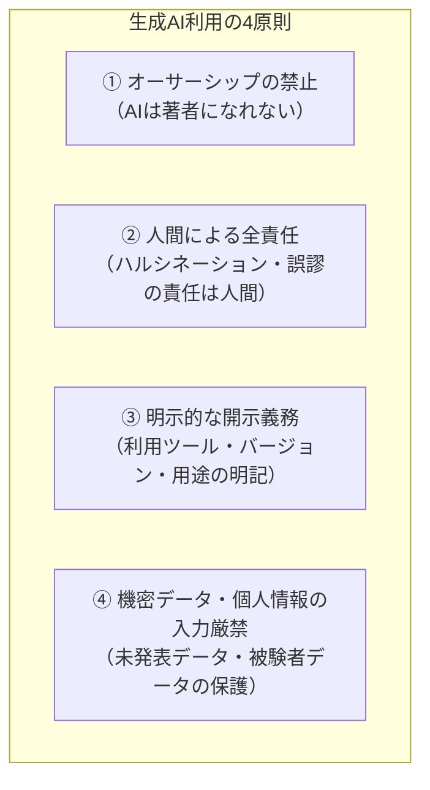
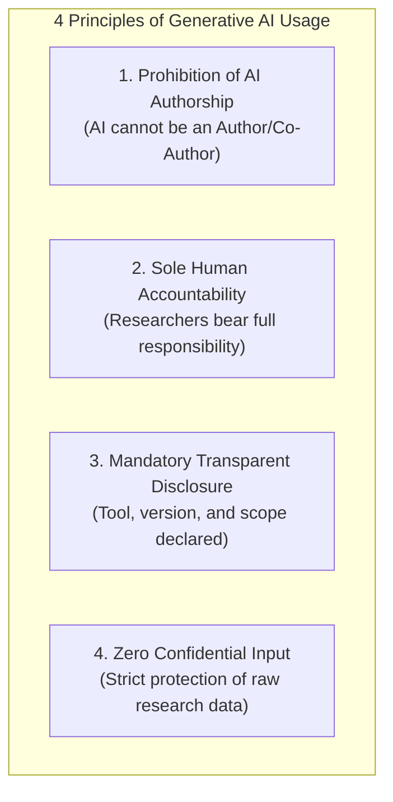

<Tabs>
  <Tab title="🇯🇵 日本語ガイドライン（Japanese）">
大規模言語モデル（LLM）や生成AIツールは、研究の生産性を飛躍的に高める一方、著作権侵害、未発表データの漏洩、ハルシネーション（幻覚）による研究不正、およびオーサーシップ（著作者責任）の曖昧化といった重大なリスクを孕んでいます。

当研究所では、人工知能学会（JSAI）、情報処理学会（IPSJ）、および国際出版倫理委員会（COPE）の最新基準に準拠し、研究活動における生成AIの利用基準を定めます。

### 4大利用原則



### 1. オーサーシップ（著作者資格）に関する厳格な禁止
- **AIツールの著者指定禁止**: ChatGPT、Claude、Gemini等のAIツールを、学術論文、研究報告、特許出願の「著者（Author）」または「共同著者（Co-Author）」として記載することは**一切認められません**。

### 2. 論文における「利用開示」の標準フォーマット
生成AIを論文執筆（構成案作成、英文校正、要約、コード生成等）に使用した場合、論文の**「謝辞（Acknowledgments）」または「研究手法（Methods/Appendix）」**に利用実態を明記しなければなりません。
  </Tab>

  <Tab title="🇬🇧 English Guidelines (Generative AI Ethics)">
While Large Language Models (LLMs) and Generative AI dramatically enhance scientific workflows, they introduce significant risks concerning copyright, data privacy, algorithmic hallucination, and the dilution of authorship accountability.

The Advanced Social Challenge Research Institute (ASCRI) mandates strict adherence to the standards established by the Japanese Society for Artificial Intelligence (JSAI), Information Processing Society of Japan (IPSJ), and the Committee on Publication Ethics (COPE).

### 4 Foundational Principles



### 1. Prohibition of AI as Author / Co-Author
- AI tools cannot be listed as an Author or Co-Author on any publication, patent, or grant application. AI lacks legal personhood and cannot accept ethical accountability.

### 2. Mandatory Declaration Format
Whenever Generative AI assists in manuscript drafting, coding, or translation, authors must explicitly disclose its scope in the **Acknowledgments** or **Methodology** section:

```text
Declaration of Generative AI in the Research Process:
During the preparation of this work, the authors used Claude 3.7 Sonnet (Anthropic) 
and GPT-4o (OpenAI) for stylistic refinement, language editing, and script debugging. 
The authors independently reviewed, verified, and take full academic responsibility 
for all data, arguments, and conclusions presented herein.
```
  </Tab>
</Tabs>
