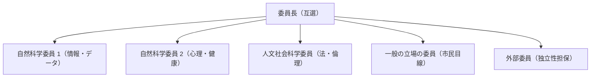

# 委員構成・候補要件・研修計画

国の倫理指針および文科省基準を満たすための、倫理審査委員会委員の構成要件、候補者の選定方針、および委員向け定期研修プログラムです。

---

## 1. 委員会の必須区分と期待される役割

委員会は**5名以上**で組織し、以下の3領域の有識者および独立した外部委員を必ず配置します（兼務不可）。

| 区分 | 期待される審査役割 | 候補者のバックグラウンド例 |
| :--- | :--- | :--- |
| **自然科学の有識者** | 研究手法の科学的合理性、データ解析の妥当性、リスク評価の確認 | 情報科学、計算機科学、看護学、心理学、公衆衛生学、統計学等の研究経験者 |
| **人文・社会科学の有識者** | 法的妥当性、基本的人権、個人情報保護、社会的公平性の確認 | 弁護士、法学研究者、生命倫理学者、社会学研究者、福祉専門職 |
| **一般の立場の者** | 研究対象者目線、説明文書の分かりやすさ、市民としての負担感の確認 | 地域住民代表、NPO実務者、消費者団体関係者、教育関係者 |
| **外部委員（複数）** | 本研究所・本法人からの完全な独立性、身内贔屓の排除 | 本法人および研究所に雇用・利害関係を持たない第三者有識者 |

---

## 2. 委員選任時の確認事項

委員を委嘱する際、事務局は以下の事項を文書（履歴書および誓約書）で確認し、記録を保存します。
1. **外部性の担保**: 本法人および研究所の役員・正職員でないことの確認。
2. **利益相反の有無**: 特定の受託企業や利害関係者との癒着がないこと。
3. **秘密保持義務**: 審査を通じて知り得た未発表研究データ・個人情報を厳重に秘匿することの誓約。
4. **男女両性の確保**: 委員全体として、男性・女性のいずれか一方のみに偏らない構成とすること。

---

## 3. 委員研修計画（年次プログラム）

委員の審査スキルと最新法令への適合を維持するため、以下の年次研修を実施・受講義務付けを行います。

| 研修プログラム | 初回委嘱時 | 継続研修頻度 | 提供元・教材 |
| :--- | :---: | :---: | :--- |
| **研究倫理の基礎** | **必須** | **年1回以上** | JSPS eL CoRE（研究倫理eラーニング） |
| **個人情報保護・データ管理** | **必須** | **年1回以上** | 個人情報保護委員会 公開研修資料 |
| **公的研究費・利益相反マネジメント** | **必須** | **年1回以上** | 文部科学省 コンプライアンス教育動画 |
| **生成AIと研究公正の最新論点** | **必須** | 必要時（随時） | 日本学術振興会・学会ガイドライン解説 |
