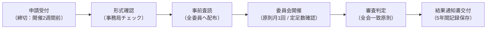

（令和8年3月18日 制定）

## 第1条（目的）
本規程は、特定非営利活動法人 Open Coral Network 附置 先端社会課題研究所（以下「本研究所」という。）が実施又は支援する人を対象とする非侵襲・低リスク研究について、ヘルシンキ宣言の趣旨に則り、倫理的かつ公正な審査を行うための**倫理審査委員会**（以下「委員会」という。）の設置及び運営に関する基本事項を定める。

---

## 第2条（対象範囲）

委員会が審査対象とする研究類型は以下の通りとする。

| 研究類型 | 対象区分 | 審査上の留意事項 |
| :--- | :---: | :--- |
| **アンケート・インタビュー調査** | **対象** | 個人情報保護、オプトアウト・同意説明手続の妥当性 |
| **観察研究・フィールドワーク** | **対象** | 非侵襲・低リスクに限る。地域住民への事前周知 |
| **LLM関連・AI対話ログ研究** | **対象** | ログ取得の明示、再識別化防止、説明責任の担保 |
| **生体試料採取・医療介入研究** | **対象外** | 大学CRB等の外部認定審査委員会で審査を行う |
| **医薬品・医療機器治験（GCP）** | **対象外** | 別法制度に基づき対応する |

---

## 第3条（委員会の構成）

1. 委員会は、**5名以上の委員**をもって構成する。
2. 委員の構成は、文部科学省・厚生労働省の倫理指針に準拠し、以下の各要件を満たさなければならない。
   - **自然科学の有識者**: 1名以上（情報科学、看護、公衆衛生、心理学等）
   - **人文・社会科学の有識者**: 1名以上（法学、倫理学、社会学、福祉学等）
   - **一般の立場の者**: 1名以上（研究対象者の視点を代表できる市民・地域住民等）
   - **外部委員**: 本研究所および本法人に所属しない外部有識者を**複数名**含むこと。
   - **男女構成**: 男女両性が必ず含まれる構成とすること。
3. 委員長は、委員の互選により選出する。

---

## 第4条（所掌事項）

委員会は、以下の事項を審査・判定する。
1. 研究計画書、説明文書、同意書、個人情報取扱計画の倫理的・科学的妥当性
2. 研究開始の適否判定（承認、条件付承認、変更勧告、不承認、中止勧告）
3. 利益相反（COI）の状況および対象者へのリスクと便益の均衡
4. 実施中の研究に関する変更申請、定期報告、有害事象報告の審査

---

## 第5条（運営原則および議決要件）

1. **定足数**: 委員会の成立には、自然科学、人文社会科学、一般の立場、外部委員をそれぞれ含む5名以上の出席を要する。
2. **議決**: 判定は原則として出席委員の**全会一致**をもって決する。
3. **除斥**: 審査対象の研究課題に関与する研究者である委員は、当該課題の審査および議決に参加できない。
4. **記録保存**: 申請書類、審査議事録、判定結果通知書は、研究終了後**5年間**厳重に施錠保管（またはセキュアアーカイブ）する。
