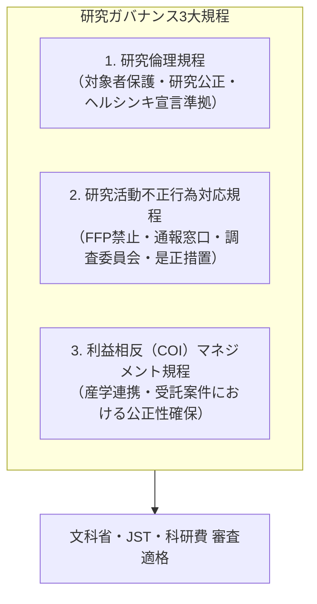

文部科学省「研究活動における不正行為への対応等に関するガイドライン」および「研究機関における公的研究費の管理・監査のガイドライン」に完全準拠した、当研究所の基幹ガバナンス規程群です。

---

## 3大規程の全体構造

---

## 1. 研究倫理規程（要約）

1. **基本原則**: 研究者は、研究対象者の尊厳、基本的人権、および自己決定権を最大限に尊重しなければならない。
2. **インフォームド・コンセント**: 研究参加に際しては、十分な情報提供を行った上で、自由意思による文書同意を得ることを原則とする。
3. **データ保存義務**: 研究成果の根拠となった実験データ、アンケート原票、プログラムコード等は、論文発表後**最低10年間**安全に保存しなければならない。

---

## 2. 研究活動不正行為対応規程（要約）

### FFP（3大研究不正）の絶対禁止
本研究所の研究者は、いかなる場合も以下の不正行為を行ってはならない。
- **捏造（Fabrication）**: 存在しないデータ、研究結果等を作成すること。
- **改ざん（Falsification）**: 研究資料・機器・過程を変更し、データや結果を歪曲すること。
- **盗用（Plagiarism）**: 他の研究者のアイデア、データ、研究結果、論文記述等を適切な引用なしに流用すること。

### 告発・通報窓口の設置
研究不正に係る告発窓口を、研究所内（事務局窓口）および**独立した外部窓口（提携公認会計士・弁護士事務所）**に設置し、通報者のプライバシーおよび不利益取扱いの禁止を厳格に保護する。

---

## 3. 利益相反（COI）マネジメント規程（要約）

1. **自己申告義務**: 研究者は、公的研究費の申請時および採択時において、過去3年間に特定の企業等から受領した報酬（年間100万円以上）、株式保有、兼業役職を事前に自己申告しなければならない。
2. **審査と回避措置**: 利益相反委員会（または倫理審査委員会）は、申告された利害関係が研究の中立性や対象者の安全に偏向をもたらす恐れがあると判断した場合、研究計画の変更や責任者の交代を勧告する。
3. **論文における開示**: 論文発表時には、研究資金の出所および利害関係の有無を論文末尾（Acknowledgments / COI Declaration）に明記する。
