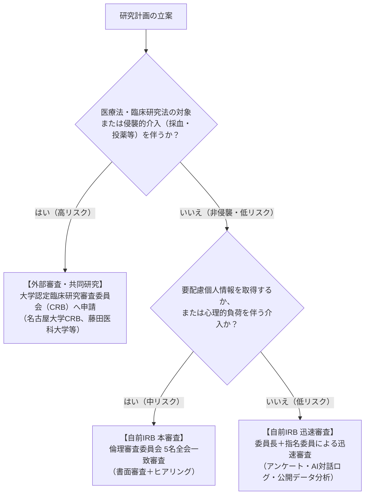

当組織が実施・支援する人を対象とする研究について、対象者の人権保護と安全管理を万全にするため、研究のリスク度合いに応じた**「審査先トリアージ判定基準（Scope Triage）」**を設けています。

---

## トリアージ判定フローチャート

---

## 3大区分の詳細基準表

| 審査区分 | 対象となる研究類型 | 審査主体 | 手続きと所要期間 |
| :--- | :--- | :--- | :--- |
| **区分1: 迅速審査 (Fast-Track)** | ・匿名アンケート調査 ・一般的なUI/UXユーザビリティテスト ・公開オープンデータのみを用いたAI分析 ・軽微な対話ログ収集（同意取得済） | 先端社会課題研究所 倫理審査委員会（委員長＋委員1名） | 申請受領から**約1〜2週間**で結果通知 |
| **区分2: 本審査 (Full Review)** | ・市民の属性・行動変容を伴うワークショップ ・位置情報や機微な生活ログの収集 ・社会的実験（地域通貨や投票実験等） ・社会的配慮を要する層（子ども・高齢者等）対象 | 先端社会課題研究所 倫理審査委員会（**委員5名全員出席**） | 原則月1回開催、申請から**約3〜4週間** |
| **区分3: 外部委託・大学CRB連携** | ・医療機器・健康食品・ハーブ等の生体介入 ・心理療法等の精神的介入を伴う実験 ・大学医学部等との公式な共同臨床研究 | **提携大学のCRB/IRB** （名古屋大学CRB、藤田医科大学CRB等） | 外部事前相談＋審査（**約2〜3ヶ月**、審査費用別途） |

---

## 提携候補大学CRBリスト（抜粋）

外部審査が必要となった場合、東海圏・近隣の以下の公認CRBと事前相談を行います（`academic/ecosystem-synergy/university-partners.mdx` 参照）。

1. **名古屋大学医学部附属病院 認定臨床研究審査委員会（CRB）**:
   - 特徴: 学術連携・学生文脈との整合性が高い。学外費用が明瞭。
2. **藤田医科大学 認定臨床研究審査委員会（CRB）**:
   - 特徴: 東海圏で産官学共同研究の導線を作りやすい。
3. **三重大学医学部附属病院 CRB / 浜松医科大学 CRB**:
   - 特徴: 地域医療・行動・健康文脈での共同研究実績多数。
