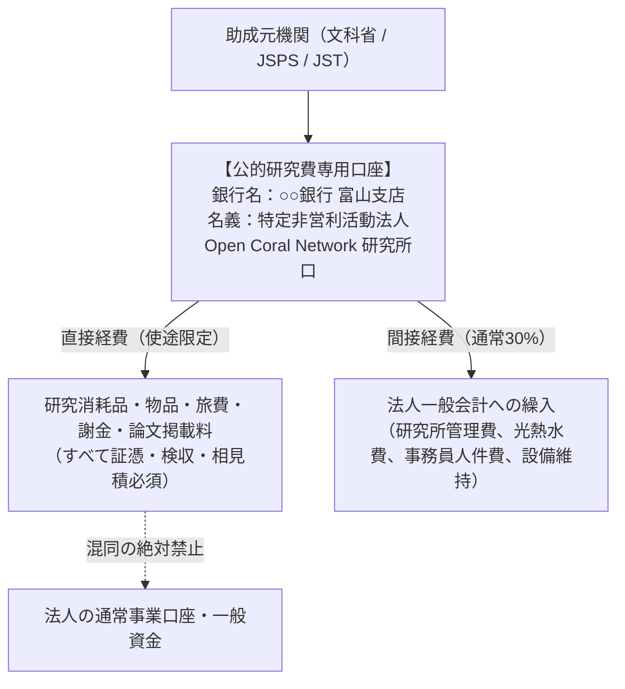

# 公的研究費専用口座・間接経費30%・NPO税務管理

公的研究費（科研費、JST、NEDO、総務省SCOPE等）を受給・執行する際、**最も返還処分や会計監査指導を受けやすいのが「口座管理」と「間接経費・税務処理」**です。

NPO法人としての財務健全性と法的コンプライアンスを両立させるため、当研究所における厳格な資金管理プロトコルを定めます。

---

## 1. 公的研究費専用口座（別段口座）の開設義務

公的研究資金は、法人の日常事業口座や一般口座と**完全に分離された「専用口座」**で管理しなければなりません。

### 口座運用の鉄則
1. **私金・他事業資金の混同禁止**: 専用口座に、他の事業売上や個人資金を一時的であっても入金・プールすることは固く禁じられます。
2. **基金化科研費の年度越え管理**: 基金化された科研費は、手続きを経ることで翌年度以降への繰越が可能ですが、単年度補助金は原則として年度内精算・余剰金の国庫返還が必要です。

---

## 2. 間接経費（オーバーヘッド：原則30%）の使途と繰入

多くの公的研究費では、直接経費（研究に直接使うお金）とは別に、**30%相当の間接経費**が機関に支給されます（例：直接経費1,000万円の場合、間接経費300万円が別途交付され総額1,300万円）。

### 間接経費の正当な使途
間接経費は、研究者の研究開発環境の改善や、機関全体の研究機能向上に資する費用として、以下の目的に充当します。
- 研究所の家賃、水道光熱費、通信費、サーバーホスティング費用
- 倫理審査委員会（IRB）の運営費用、外部委員謝金
- 経理・事務補助員の人件費
- 知的財産権（特許出願等）の出願・維持費用
- 図書、共有機器等の研究基盤設備の保守点検費用

---

## 3. NPO会計基準 ＆ 法人税法上の税務処理

NPO法人が公的研究費を受託する場合、税務上の「収益事業」に該当するかどうかが極めて重要です。

| 資金の種類 | NPO会計上の区分 | 法人税法上の取扱い（34業種判定） | 消費税の取扱い |
| :--- | :--- | :--- | :--- |
| **科学研究費補助金（科研費）** | 受領寄付金 / 補助金会計 | **非課税（収益事業に該当しない）** | **不課税（対価性なし）** |
| **国の競争的研究費（JST/SCOPE等）** | 受託研究収益 または 補助金 | 原則として**学術研究助成は非課税**。ただし成果物の納入義務・知財独占譲渡がある民間受託は「学術技芸教授業・請負業」として課税判定のリスクあり | 助成金型は不課税、請負型は課税売上 |
| **民間財団助成金（トヨタ財団等）** | 助成金会計 | **非課税** | **不課税** |

> [!IMPORTANT]
> **税理士・会計士との事前合意**:
> 研究開発成果を特定企業に独占譲渡する形式の受託研究は「収益事業」とみなされ法人税が課される場合があります。文科省・JST・財団助成金については、公募要領上の「補助金・交付金」性格を明示し、非課税処理を行うことについて顧問税理士の確認印を取得しておく必要があります。
