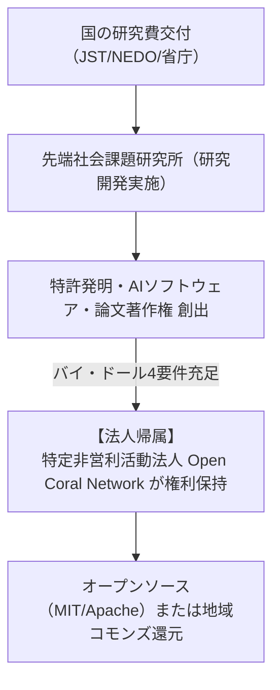

国の受託研究や公的研究費において生み出された特許権や著作権等の知的財産権（IP）を法人が保持し、社会実装やオープンソースとして還元するためには、**「職務発明規程（日本版バイ・ドール法対応）」**の制定が必須要件となります。

また、文部科学省・JST・NEDO等では、すべての採択課題に対して**「データマネジメントプラン（DMP）」**の策定・オープンアクセス公開が義務付けられています。

---

## 1. 日本版バイ・ドール条項（産業技術力強化法第17条）の適用

国の研究資金から生まれた知的財産権は、原則として国に帰属しますが、以下の4要件を満たすことで**特定非営利活動法人 Open Coral Network に100%帰属**させることができます。

### バイ・ドール適用のための4要件
1. **成果発生の遅滞なき報告**: 研究成果である発明・ソフトウェアを国に遅滞なく報告すること。
2. **国への無償実施権許諾**: 国が公共の利益のために必要とする場合、無償で実施する権利を国に許諾すること。
3. **第三者への正当な実施許諾**: 相当期間正当な理由なく実施されない場合、国が第三者への実施許諾を求める権利を留保すること。
4. **職務発明規程の存在**: 法人内に、研究者の職務発明を法人に帰属させ、相当の報償金を支払う規程が制定されていること。

---

## 2. 職務発明・知的財産規程（抜粋）

1. **権利の帰属**: 本研究所の研究活動および公的研究開発業務の過程において従事者が行った発明・考案・意匠・プログラム著作権は、**原則として本法人に帰属**する。
2. **実績報償金**: 法人が当該知的財産権のライセンスまたは譲渡等により収益を得た場合、または顕著な学術・社会的インパクトをもたらした場合は、所定の評価に基づき発明者（研究員）に報償金を支給する。
3. **オープンソース・オープンデータ化の特例**: 発明者および研究所長が合意した場合、当該知的財産をMITライセンス、Apache 2.0、またはCC-BY等のオープンライセンスとして全世界に無償公開することができる。

---

## 3. データマネジメントプラン（DMP）策定基準

文科省・JST等の公募要領に基づき、研究開始時に提出するDMPの標準構成です。

| DMP項目 | 当研究所の標準方針 | 実務対応 |
| :--- | :--- | :--- |
| **データ種別** | 実証実験ログ、対話要約データ、シビックアンケート集計、ソースコード | 個人特定情報は完全削除（匿名化済データのみ） |
| **データ公開区分** | **オープン公開（Open Access）** | 原則として全世界に無料公開（Zenodo / GitHub） |
| **メタデータ標準** | Dublin Core / DataCite 準拠（DOI付与） | 機械可読性（JSON-LD / CSV / Markdown）を担保 |
| **保管リポジトリ** | **Zenodo**（欧州CERN）および法人公式GitHubリポジトリ | 10年以上の永続保存保証 |
| **利用許諾ライセンス** | ソフトウェア：`MIT License` / データ：`CC-BY 4.0` | 商用利用・二次利用を歓迎するコモンズ方針 |
