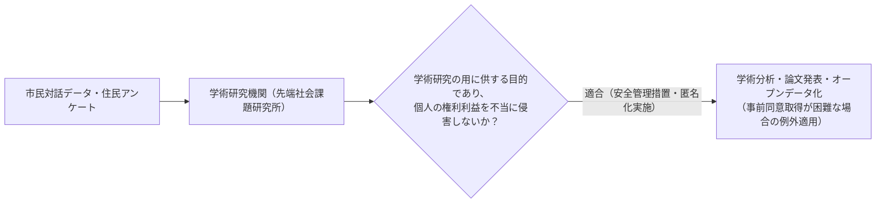
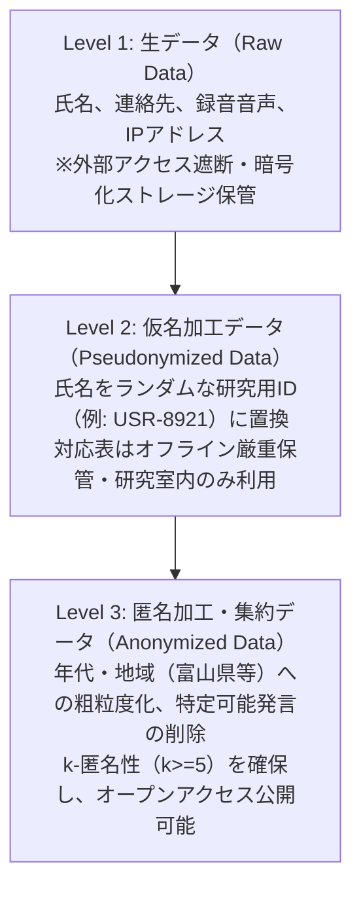

# 個人情報保護法の学術研究例外とデータ匿名化基準

地方自治体との連携や市民ワークショップにおいて、対話ログやアンケートデータを収集・分析する際、**個人情報の保護に関する法律（個人情報保護法）**の厳格な遵守が求められます。

当研究所は学術研究機関として、法第16条・第27条等に定められた**「学術研究目的の適用除外規程」**を正当に適用しつつ、個人の権利利益を侵害しない高度な匿名化技術基準を定めます。

---

## 1. 個人情報保護法における「学術研究目的の適用除外」

令和2年・令和3年改正個人情報保護法により、民間学術研究機関に対する規律が見直され、以下の要件を満たす場合に限り、利用目的の制限や第三者提供制限の例外が認められます。

### 適用除外の対象となる主な場面
- 学術研究目的のために、取得時の利用目的の範囲を超えてデータを学術分析する場合（法第16条第3項第4号）
- 大学や外部研究機関との共同研究において、統計的・学術的分析のためにデータを提供する場合（法第27条第1項第5号）

---

## 2. 匿名化・仮名化の3段階データパイプライン

市民のプライバシーを守り、オープンデータ化を可能にするためのデータ加工基準です。

| レベル | データ状態 | 利用可能範囲 | 公開可否 |
| :--- | :--- | :--- | :---: |
| **Level 1 (生データ)** | 氏名・電話番号・メールアドレス・音声原データ | 調査担当者（鍵管理責任者）のみ | ❌ 絶対不可 |
| **Level 2 (仮名加工)** | 氏名を一方向ハッシュIDへ置換、対応表分離 | 研究所内の共同研究者（守秘義務者） | ❌ 不可 |
| **Level 3 (匿名加工)** | 誰が発言したか復元不可能な集計値・抽象化テキスト | 全世界の研究者・市民（Zenodo/GitHub） | ⭕ **完全公開可能** |

---

## 3. 再識別化防止（k-匿名性）の担保ルール

オープンデータや学会発表資料として公開するテキスト・表データについては、**「k-匿名性（k >= 5）」**を基準とします。
- **具体例**: 「富山市八尾町在住の70代男性で○○の役職」のように、属性の掛け合わせによって地域内で個人が1名に特定されてしまう微細データは、属性を「富山県」「シニア層」等に丸め込み（一般化処理）、5名以上の集団に紛れ込ませる処理を徹底します。
