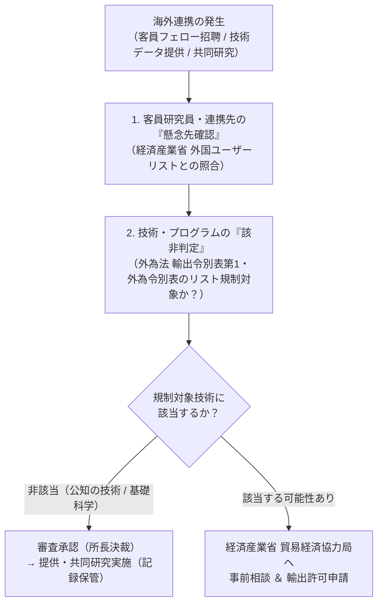

文部科学省・経済産業省・JST等は、公的研究機関に対して**「外国為替及び外国貿易法（外為法）」に基づく安全保障貿易管理体制の構築**を義務付けています。

スリランカ大学等の海外研究機関や非居住者（海外研究者）との共同研究、先端AIプログラム・暗号技術の提供に際し、不法な軍事転用や大量破壊兵器拡散を防ぐための審査プロトコルを定めます。

---

## 安全保障貿易管理の基本フロー

---

## 1. 該非判定の除外特例（基礎科学研究の特例）

外為法および輸出管理令において、以下の技術提供は**経済産業大臣の許可を要しない特例**として認められています。

1. **公知の技術（すでに公開されている技術）**:
   - 学術誌、学会予稿集、一般図書、インターネット上で一般に公衆がアクセス可能な情報・オープンソースコード（GitHubで公開済みのもの）。
2. **基礎科学分野の研究活動**:
   - 自然科学の分野における原理の究明を主たる目的とする活動であり、特定の製品・軍事応用に直結しない理論研究。

> [!TIP]
> 当研究所の提供する技術・論文が**「オープンソース（MITライセンス等で公開済み）」**または**「査読論文・プレプリント（Zenodoで公開済み）」**である限り、原則として外為法上の事前許可は不要（公知技術特例）となります。ただし、その判定プロセスを記録に残しておくことが監査要件です。

---

## 2. 懸念先確認（外国ユーザーリスト照合）

海外の共同研究者や海外大学と契約を締結する際、経済産業省が年次更新する**「外国ユーザーリスト（End-User List）」**に当該大学・機関・個人が掲載されていないことを照合・確認します。

- **確認対象**: スリランカ大学等、連携先大学・機関名
- **確認エビデンス**: 経産省HPの外国ユーザーリストPDFにて検索し、非該当である旨のチェックシートを作成・保管する。
