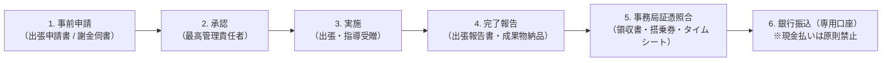

# 公的研究費 旅費支給規程・謝金支給基準

文部科学省の公的研究費監査では、**「法人の正式な旅費規程や謝金規程が存在しない状態での支出」は不正受給・返還命令の対象**となります。

本規程は、研究出張および外部専門家・研究協力者への適正な経費支出を行うための公式基準です。

---

## 1. 旅費支給基準（国内出張・海外出張）

研究出張（学会発表、現地フィールドワーク、打合せ等）における旅費は、原則として**実費精算（領収書必須）**とします。

### 国内旅費基準
| 項目 | 支給基準 | 必要エビデンス |
| :--- | :--- | :--- |
| **鉄道賃** | 実費（新幹線指定席可、グリーン席不可） | 領収書、特急券・乗車券現物またはスマートEX利用明細 |
| **航空賃** | 実費（エコノミークラスに限る） | 領収書、搭乗券半券（または保安検査証・搭乗証明書） |
| **宿泊費** | 定額上限：1泊 **12,000円（税込）**（東京23区等は14,000円） | ホテル発行の領収書（明細付き） |
| **日当** | 1日 **2,000円**（片道100km以上かつ移動時間を要する場合） | 出張報告書（用務・訪問先・成果を記載） |

### 海外旅費（スリランカ等への渡航）
- 航空運賃は最安エコノミークラスの正規割引運賃（PEX）を原則とし、旅行代理店の見積書・領収書・eチケット控え・搭乗券半券を保管する。
- 宿泊料および日当は、JICA・外務省基準を参考とした所定の日当表（スリランカ：宿泊料約10,000円/泊、日当約4,000円/日）を適用する。

---

## 2. 謝金・リサーチアシスタント（RA）雇用基準

外部専門家への助言指導、被験者謝礼、および学生・若手エンジニアをRAとして雇用する場合の標準単価基準です。

| 職種・区分 | 業務内容 | 支給単価基準（税引前） |
| :--- | :--- | :--- |
| **特別専門謝金** | 大学教授、弁護士、医師等による学術指導・基調講演 | **15,000円〜30,000円 / 回（または時間）** |
| **専門的助言謝金** | 外部有識者による倫理審査委員、ワークショップ講師 | **10,000円 / 回（2時間程度）** |
| **研究補助員（RA）** | データ入力、プログラミング、論文組版、被験者誘導（大学院生・若手） | **時給 1,500円〜2,000円** |
| **一般被験者謝礼** | 1回30分〜1時間のアンケート回答・ユーザビリティテスト参加 | **1,000円〜2,000円相当（図書カード・電子ギフト）** |

---

## 3. 支出時の必須チェックフロー

1. **現金払いの禁止**: 旅費・謝金の支払いは、原則として受取人の銀行口座への振込（振込明細保管）とし、手渡し現金払いは不正防止のため厳禁とします。
2. **源泉徴収の徹底**: 個人への謝金・原稿料支払いに際しては、所轄税務署への源泉徴収（10.21%）を適正に行い、納付します。
