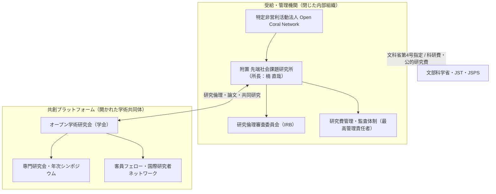

特定非営利活動法人 Open Coral Network 附置 **「先端社会課題研究所」**、および多元的社会ガバナンスとシビックテクノロジーを探求する**「オープン学術研究会（学会）」**の統合ポータルです。

本ハンドブックは、文部科学省「第4号指定研究機関（科研費受給資格）」の取得、公的研究資金（JST/NEDO/SCOPE等）の獲得・適正執行、人を対象とする研究倫理審査（IRB）、および国際共同研究の実務プロトコルを体系化しています。

---

## 3大ミッションと組織の二重構造

当組織は、行政上の受給資格を持つ**「研究機関（研究所）」**と、研究者・実践者がフラットに集う**「オープン学会（コミュニティ）」**の二重構造（Dual Architecture）によって運営されます。

---

## ハンドブックの主要セクション

<CardGroup cols={2}>
  <Card title="1. 組織・研究所・学会" icon="building-columns" href="/academic/organization/dual-structure">
    研究所と学会の分離定義、先端社会課題研究所設置規程、学会会則、客員フェロー招聘規程。
  </Card>
  <Card title="2. 文科省第4号指定" icon="stamp" href="/academic/mext-designation/factcheck-5requirements">
    科学研究費取扱規程第2条第1項第4号の5大要件ファクトチェック、事前照会手順、物理拠点基準。
  </Card>
  <Card title="3. 学術論文・外部SIG・DOI" icon="book-bookmark" href="/academic/academic-pipeline/hybrid-publishing-strategy">
    自前紀要リスク対策、推奨外部SIG（JSAI / IPSJ）、Typst論文組版キット、Zenodoによる即時DOI発行。
  </Card>
  <Card title="4. 研究倫理・IRBガバナンス" icon="scale-balanced" href="/academic/governance-ethics/triage-scope">
    自前IRBと大学CRBの振り分け判定、倫理審査委員会設置規程、審査手順書、生成AI利用倫理ガイドライン。
  </Card>
  <Card title="5. 経理・税務・知財・外為法" icon="file-invoice-dollar" href="/academic/grant-finance/dedicated-account-indirect-costs">
    公的研究費専用口座管理、間接経費30%とNPO税務、旅費・謝金規程、バイ・ドール法対応知財規程、外為法該非判定。
  </Card>
  <Card title="6. エコシステムシナジー" icon="arrows-spin" href="/academic/ecosystem-synergy/auto-grants-research-loop">
    Auto-Grantsによる公募自律スキャンと研究所PoCの循環、Nexloom学会運営、日本学術会議協力団体ロードマップ。
  </Card>
  <Card title="7. 英語リソース・国際レジストリ" icon="globe" href="/academic/english-resources/ror-and-orcid">
    ROR（国際研究組織レジストリ）、ORCID、英文研究所憲章（Charter）、客員フェロー英文委嘱状。
  </Card>
</CardGroup>

---

## コア指標（Key Milestones）

| フェーズ | 目標マイルストーン | 達成状態 / 期限 |
| :--- | :--- | :--- |
| **Phase 1** | 国際研究者ID（ORCID）取得 ＆ ROR組織登録申請 | ✅ ORCID取得完了 / ROR申請済 |
| **Phase 1** | 研究倫理審査委員会（IRB）規程策定・書式整備 | ✅ 5規程・書式集 整備完了 |
| **Phase 2** | 客員上席研究員（スリランカ大学教授）正式委嘱 | 進行中（2026年Q4） |
| **Phase 2** | 情報処理学会（IPSJ IS178）研究発表 ＆ CiNii収録 | 進行中（2026年12月発表予定） |
| **Phase 3** | e-Rad 機関登録 ＆ 文科省学術研究助成課 事前照会 | 2026年10月〜11月 |
| **Phase 4** | 文部科学省「第4号指定研究機関」本審査申請・指定告示 | 2027年Q1（科研費受給資格取得） |
