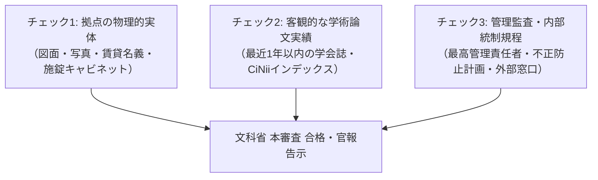

文部科学大臣が指定する**「第4号指定研究機関（科学研究費補助金取扱規程第2条第1項第4号）」**は、大学や公的研究機関以外の民間法人（一般社団、一般財団、一定の法人等）が科研費の直接受給資格を得るための公的制度です。

ネット上には「エフォート50%必須」「CiNiiに1本あれば機械的合格」「債務超過で即失格」「バーチャルオフィス絶対不可」などの俗説が氾濫していますが、本ページでは文科省の公式要項に基づき、真実の審査基準をファクトチェックします。

---

## 根拠法令および公式基準

1. **科学研究費補助金取扱規程**（昭和40年文部省告示第110号）第2条第1項第4号
2. **「科学研究費補助金取扱規程第2条第1項第1号及び第4号並びに同条第4項の機関の指定に関する要項」**（文部科学省）
3. **「研究機関における公的研究費の管理・監査のガイドライン（実施基準）」**（文部科学省）
4. **「研究活動における不正行為への対応等に関するガイドライン」**（文部科学省）

---

## 5大要件の公式ソース照合結果

| 要件項目 | 巷の俗説・誤解 | 公式要項の実態 | 判定 |
| :--- | :--- | :--- | :---: |
| **① 目的と組織** | 定款に「学術研究」が必須、事業部から完全に独立した研究所が必要 | 定款の設置目的・業務内容に学術研究に関連する記述が必要。「内部組織に関する規約」提出が求められるが、「事業部から完全に独立」までの明文はない（実態の区別は重視）。 | ⚠️ 概ね正確だが過剰表現 |
| **② 本務研究者** | エフォート50%以上必須、CiNii 1本で機械的合格 | **「エフォート50%」は指定要件に明文なし**（個別課題申請の概念）。正確には「研究活動を職務に含む常勤研究者が在籍していること」。原著論文発表状況は定性・定量審査。 | ⚠️ 俗説排除が必要 |
| **③ 物理的拠点** | 施錠個室が絶対必須、バーチャルは不可 | 「個室」の明文はないが、公的研究費管理ガイドラインに基づく**物品検収・保管・経理証憑の施錠管理が可能な物理的実体**が必須。バーチャルオフィスは事実上不可。 | ⭕ 実質的に正確 |
| **④ 財務健全性** | 債務超過なら門前払いで不合格 | **「債務超過禁止」の一律基準は公式文書にない**。ただし公的研究費を適正に管理・執行できる経営基盤が求められるため、実質審査に影響する。 | ❌ 明文化なし |
| **⑤ 管理・倫理体制** | 弁護士通報窓口が必須、倫理教育必須 | 管理・監査ガイドラインに基づく最高管理責任者等の任命、不正防止計画、通報窓口（公認会計士等でも可）、倫理教育（JSPS eL CoRE等）が**必須**。 | ⭕ 正確 |

---

## 重大な前提問題：NPO法人は対象か？

科学研究費補助金取扱規程 第2条第1項第4号の条文原文：
> 「国若しくは地方公共団体の設置する研究所その他の機関、特別の法律により設立された法人若しくは当該法人の設置する研究所その他の機関、国際連合大学の研究所その他の機関（国内に設置されるものに限る。）又は **一般社団法人若しくは一般財団法人** のうち学術研究を行うものとして別に定めるところにより文部科学大臣が指定するもの」

> [!WARNING]
> **条文上、明記されているのは「一般社団法人」「一般財団法人」です。**
> 「特定非営利活動法人（NPO法人）」は直接列挙されていませんが、文部科学省の過去の指定一覧には複数のNPO法人（特定非営利活動法人）が含まれています。
> ただし、申請前に**文部科学省研究振興局学術研究助成課への「事前照会（Phase 0）」が必須手続き**となります。

---

## 3大実務チェックポイント

1. **拠点の物理的実体**:
   - 賃貸借契約書の名義が法人名義であること。
   - 研究室・事務室としての専用区画が存在し、施錠可能な物品保管庫が配備されていること。
2. **客観的学術実績（第三者の証明）**:
   - 常勤研究者が最近1年間に発表した原著論文が、第三者データベース（CiNii Research / J-STAGE）で確認できること。
   - 自前組織の身内紀要ではなく、外部学会での発表実績が審査官に納得感を与える。
3. **管理体制の完全整備**:
   - 公的研究費管理・監査ガイドラインに即した3大責任者の理事会任命、および研究3規程が制定・公開されていること。
