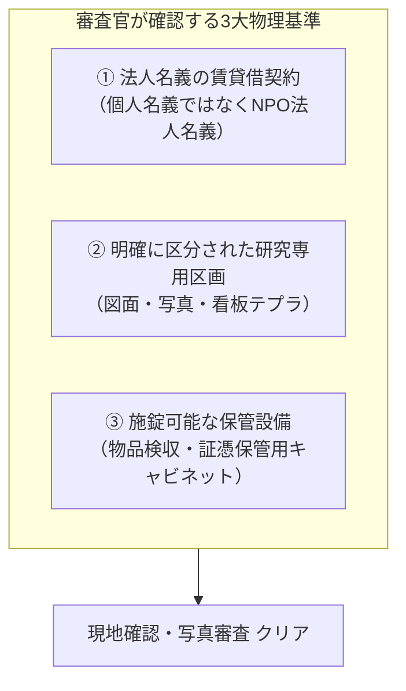
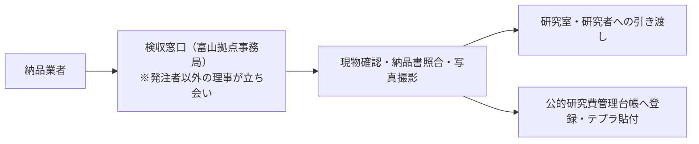

# 物理的拠点・専用区画・施錠管理基準

文部科学省「研究機関における公的研究費の管理・監査のガイドライン（実施基準）」では、公的研究費によって購入された物品の検収・管理、および経理証憑書類の安全保管が義務付けられています。

そのため、バーチャルオフィスやオープンスペースのみでは審査を通過できません。本ページでは、富山拠点（空き家再生サードプレイス等）や本部において、**「文科省審査官が現地確認または写真審査で納得する物理的研究室の整備基準」**を規定します。

---

## 物理的拠点の3大必須要件

---

## 1. 賃貸借契約書の確認要件

- **賃借人名義**: 必ず**「特定非営利活動法人 Open Coral Network」**とする（役員個人名義での契約は不可。個人所有物件の場合は、法人への正規の無償または有償賃貸借契約を締結する）。
- **使用目的**: 契約書上の使用目的に「事務所」「研究室」または「学術研究活動」が含まれていること。
- **添付図面**: 物件全体の間取り図の中で、本研究所が専有するエリアがマーキングされていること。

---

## 2. 専用研究区画の整備仕様（富山サードプレイス等の活用）

空き家再生拠点や複合施設内の一部を研究所とする場合、以下の設えを整えます。

| 設備・環境 | 具体的仕様 | 審査上のポイント |
| :--- | :--- | :--- |
| **表札・掲示** | 執務室ドアまたは専用デスクに「特定非営利活動法人Open Coral Network 附置 先端社会課題研究所」の看板を掲示 | 組織の実体を示す |
| **研究用デスク・PC** | 常勤研究者用の執務デスク、モニター、解析用PC、書架 | 研究活動が実際に行われている環境 |
| **物品保管キャビネット** | **鍵付きの書庫またはスチールキャビネット**を設置。「公的研究費 物品・証憑保管庫」とテプラ貼付 | 科研費で購入した物品（高価機器、ソフトウェア等）を施錠管理可能であることの証明 |
| **通信・セキュリティ** | WPA3暗号化Wi-Fi、有線LAN、入退室ログまたは施錠管理（スマートロック等） | 未発表研究データおよび個人情報の漏洩防止 |

---

## 3. 物品検収体制（検収センター）の設置

公的研究費で購入した物品（PC、書籍、消耗品等）が不正に流用・架空請求されないよう、**「発注者以外の第三者による検収窓口（検収センター）」**を物理拠点内に設けます。

1. **検収印の押印**: 納品書に対し、検収担当者が現物を確認した上で検収印（日付・サイン）を押す。
2. **資産シール（テプラ）の貼付**: 1点10万円以上の備品には「特定非営利活動法人Open Coral Network 附置 先端社会課題研究所 備品管理番号 ○○○○」を貼付して管理台帳に記載する。
3. **写真記録の保存**: 申請書類添付用として、研究室全景、施錠キャビネット、表札、検収デスクの写真を常時最新状態で保管する。
