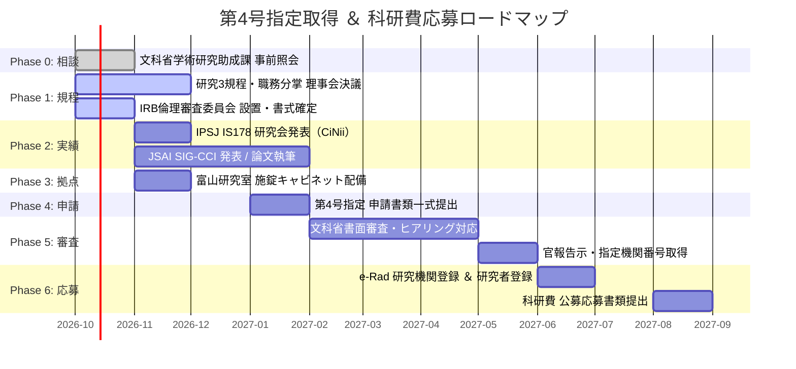

# 申請〜指定〜e-Rad登録 全体工程表

文部科学省「第4号指定研究機関」の取得手続きは、書類提出から官報告示（指定完了）までに**最低3ヶ月**を要します。毎年9月頃に公募が始まる科研費に間に合わせるため、逆算したスケジュールで各工程を並行稼働させます。

---

## 全体フェーズと所要期間

---

## 各フェーズの詳細アクション

### Phase 0: 文科省事前照会（2026年10月）
- 学術研究助成課へ電話照会（NPO法人の適格性確認、最新様式の受領）
- 担当係名および連絡窓口の確保

### Phase 1: 内部ガバナンス・規程の整備（2026年10月〜12月）
- 先端社会課題研究所 設置規程・職務分掌規程（理事会決議）
- 研究3大規程（研究倫理規程、研究不正防止規程、公的研究費管理規程、利益相反規程）制定
- 倫理審査委員会（IRB）の委員任命・書式公開

### Phase 2: 学術実績の構築（2026年11月〜2027年2月）※最重要
- 情報処理学会（IPSJ IS178）研究会発表（2026年12月5日・多摩大学）
- 人工知能学会（JSAI SIG-CCI）等での実践報告発表
- CiNii Research および 情報学広場 での書誌情報インデックス確認
- 申請添付書類「最近1年間の原著論文一覧表」の作成完了

### Phase 3: 物理拠点の整備（2026年11月〜12月）
- 富山活動拠点における法人名義賃貸契約の確認
- 専用研究区画の整備、表札掲示、施錠スチールキャビネット配備
- 物品検収窓口の設置、申請用写真撮影

### Phase 4: 指定申請書類の作成・提出（2027年1月〜2月）
- 申請書（13項目）の作成
  - 機関名称・住所・代表者
  - 設置目的・業務内容（定款添付）
  - 研究者の採用基準・研究計画立案規程
  - 常勤研究者（楠直哉等）の略歴書
  - 最近1年間の原著論文一覧表
  - 研究者1人当たりの研究費内訳書
  - 公的研究費管理・監査体制図、研究倫理体制
- 事前相談（ドラフト確認）を経て本提出

### Phase 5: 文科省書面審査・ヒアリング（2027年2月〜5月）
- 文科省担当官からの質問照会への回答・追加資料提出
- 必要に応じた現地確認またはオンラインヒアリング対応
- 文部科学大臣による指定決定・官報告示（5桁の機関番号付与）

### Phase 6: e-Rad機関登録 ＆ 科研費応募（2027年6月〜9月）
- e-Rad（府省共通研究開発管理システム）への「指定研究機関」登録
- 常勤研究者を「科研費応募資格あり」としてe-Radに登録
- JSPS eL CoRE（研究倫理eラーニング）受講・修了証保管
- 科研費公募（基盤研究(C)、若手研究、萌芽研究等）への電子申請完了
