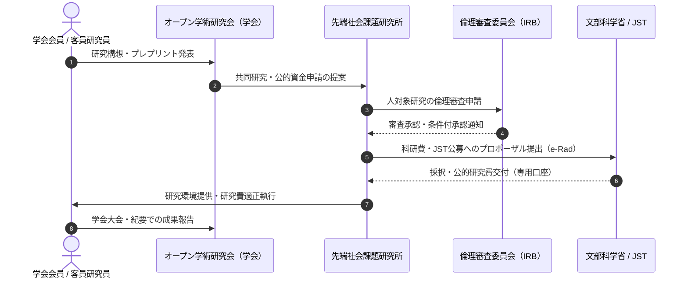

# 二重構造の役割分担（研究所と学会）

特定非営利活動法人 Open Coral Network における学術活動は、**「先端社会課題研究所（受給・管理機関）」**と**「オープン学術研究会（共創学会）」**という、法的・機能的に明確に分離された二重構造（Dual Architecture）によって推進されます。

この分離は、文部科学省「第4号指定研究機関」の厳格な管理責任を果たすと同時に、境界のないオープンな学術コミュニティを両立させるための最重要アーキテクチャです。

---

## なぜ分離が必要なのか？

| 比較項目 | 附置 先端社会課題研究所 (Institute) | オープン学術研究会・学会 (Society) |
| :--- | :--- | :--- |
| **法的性質** | NPO法人内部の恒常的研究部門（非法人） | 学会則に基づく任意学術団体・共同体 |
| **主目的** | 学術研究の実施、公的研究費の受託・適正管理 | 研究交流、発表の場、論文査読、コミュニティ共創 |
| **文科省第4号指定** | **指定の申請・受給対象となる実体組織** | 指定の対象外（受給機関にはなれない） |
| **ガバナンス** | 最高管理責任者・コンプライアンス推進体制 | 会長・幹事会・プログラム委員会（PC） |
| **メンバーシップ** | 雇用契約・職務分掌に基づく研究員・所長 | 会員規約に基づく正会員・学生会員・コミュニティ会員 |
| **予算・口座** | 公的研究費専用口座、間接経費の管理 | 会費収入、大会参加費、協賛金 |

> [!IMPORTANT]
> **「学会」を作っても科研費の受給資格は得られません。**
> 文部科学省「第4号指定」を受けるのは、研究者を雇用し、研究倫理体制と会計監査体制を持つ「特定非営利活動法人（附置研究所）」です。学会はあくまで研究発表とネットワークを広げるためのプラットフォームです。

---

## 二重構造の連携プロセス

---

## 役割と権限の境界管理

1. **研究費執行の独立性**:
   - 科研費やJST等の公的研究費の管理・執行は、すべて先端社会課題研究所の管理監査体制の下で行い、学会の一般会計と混同してはならない。
2. **客観的評価の担保**:
   - 研究所の研究員が学会で発表する場合、学会のプログラム委員会は身内贔屓（びいき）を排除し、外部査読者を含む厳格な審査基準を適用する。
3. **成果のオープン化**:
   - 研究所で生み出された理論・オープンデータ・ソフトウェアは、学会および Open Coral Network のコモンズ（共有財産）として社会に広く還元する。
