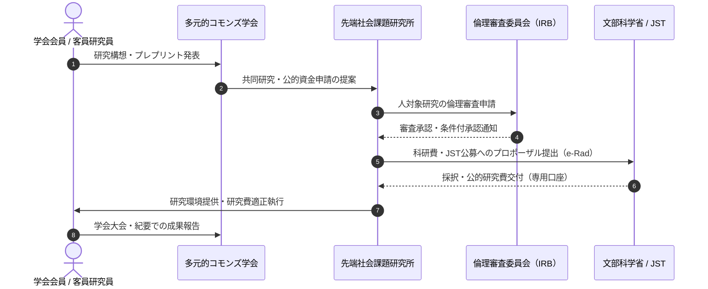
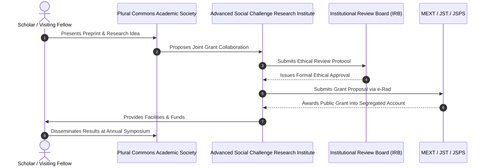

<Tabs>
  <Tab title="🇯🇵 日本語（Japanese）">
特定非営利活動法人 Open Coral Network における学術活動は、**「先端社会課題研究所（受給・管理機関）」**と**「多元的コモンズ学会（共創学会）」**という、法的・機能的に明確に分離された二重構造（Dual Architecture）によって推進されます。

この分離は、文部科学省「第4号指定研究機関」の厳格な管理責任を果たすと同時に、境界のないオープンな学術コミュニティを両立させるための最重要アーキテクチャです。

### なぜ分離が必要なのか？

| 比較項目 | 附置 先端社会課題研究所 (Institute) | 多元的コモンズ学会 (Society) |
| :--- | :--- | :--- |
| **法的性質** | NPO法人内部の恒常的研究部門（非法人） | 学会則に基づく任意学術団体・共同体 |
| **主目的** | 学術研究の実施、公的研究費の受託・適正管理 | 研究交流、発表の場、論文査読、コミュニティ共創 |
| **文科省第4号指定** | **指定の申請・受給対象となる実体組織** | 指定の対象外（受給機関にはなれない） |
| **ガバナンス** | 最高管理責任者・コンプライアンス推進体制 | 会長・幹事会・プログラム委員会（PC） |
| **メンバーシップ** | 雇用契約・職務分掌に基づく研究員・所長 | 会員規約に基づく正会員・学生会員・コミュニティ会員 |
| **予算・口座** | 公的研究費専用口座、間接経費の管理 | 会費収入、大会参加費、協賛金 |

> [!IMPORTANT]
> **「学会」を作っても科研費の受給資格は得られません。**
> 文部科学省「第4号指定」を受けるのは、研究者を雇用し、研究倫理体制と会計監査体制を持つ「特定非営利活動法人（附置研究所）」です。学会はあくまで研究発表とネットワークを広げるためのプラットフォームです。

### 二重構造の連携プロセス

  </Tab>

  <Tab title="🇬🇧 English（Dual Architecture）">
Academic initiatives at Specified Nonprofit Corporation Open Coral Network are governed by a strictly delineated **Dual Architecture**: the **Advanced Social Challenge Research Institute (ASCRI)** as the grant-receiving institution, and the **Plural Commons Academic Society (PCAS)** as the open scholarly community.

### Functional Matrix: Institute vs. Society

| Dimension | Research Institute (ASCRI) | Academic Society (PCAS) |
| :--- | :--- | :--- |
| **Legal Nature** | Permanent internal research department of NPO | Independent scholarly community under society bylaws |
| **Primary Mandate** | Research execution, public grant compliance | Scholarly exchange, conference hosting, peer review |
| **MEXT Item 4 Status** | **The legally eligible host for KAKENHI grants** | Not eligible for institutional designation |
| **Governance** | Chief Administrative Officer & Compliance Board | Society President, Steering Committee & PC Chair |
| **Membership** | Appointed Fellows, Research Assistants & Director | Regular Members, Student Members & Community Members |
| **Financial Accounts** | Segregated public grant bank accounts & overhead | Membership dues, conference registration & donations |

> [!IMPORTANT]
> **An academic society alone cannot receive Japanese government KAKENHI grants.**
> MEXT designation is granted strictly to legal entities with established employment contracts, an Institutional Review Board (IRB), and audited financial structures (ASCRI). The Society serves as the open intellectual forum.

### Operational Sequence

  </Tab>
</Tabs>
