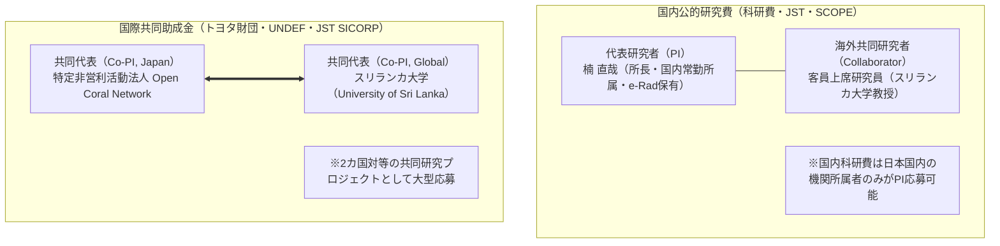

先端社会課題研究所における国際共同研究の推進、論文共著、および国際助成金獲得を確固たるものにするため、国内外の卓越した学術研究者を**「客員上席研究員（Visiting Senior Fellow）」**として招聘する制度です。

---

## 1. 招聘の目的と国内・国際グラントにおける役割分担

海外大学所属の研究者（例：スリランカ大学教授陣）と連携する場合、**「日本国内の科研費」と「国際助成金」で申請体制（PI / 共同PI）が法的に異なります**。



---

## 2. 客員フェロー招聘規程（要約）

1. **称号**: 先端社会課題研究所 客員上席研究員（Visiting Senior Fellow）
2. **任期**: 委嘱日より1年間（理事会承認により更新可能）
3. **職務**:
   - 年間1回以上の国際共同研究論文の執筆または共著
   - 本研究所が主催する研究会・シンポジウムでの助言または登壇
   - 国際助成プログラムへの共同申請
4. **処遇**: 原則として客員身分（無給・名誉職）。助成金採択時は、直接経費から研究謝金・渡航旅費を規程に基づき支給する。
5. **アフィリエーション記載**: 共同論文発表時、「Visiting Senior Fellow, Advanced Social Challenge Research Institute, Open Coral Network」を共著者所属として併記することができる。

---

## 3. 正式委嘱状テンプレート（日英併記）

正式発行用の文書テンプレートです（理事長印を押印してPDF発行）。

<Tabs>
  <Tab title="委嘱状（日本語正本）">
```markdown
委 嘱 状

特定非営利活動法人 Open Coral Network
附置 先端社会課題研究所
代表理事・所長　楠 直哉

貴殿の卓越した学術的見識とこれまでの顕著な研究業績に鑑み、
当研究所の「客員上席研究員（Visiting Senior Fellow）」として
ここに正式に委嘱申し上げます。

記

1. 役職名称：特定非営利活動法人 Open Coral Network 附置 先端社会課題研究所 客員上席研究員
2. 委嘱期間：2026年10月1日 〜 2027年9月30日（更新あり）
3. 担当分野：AI協調型社会システム、シビックインテリジェンス、国際共同研究
4. 協働内容：
   (1) 多元型社会ガバナンスに関する国際共同学術論文の執筆および共著
   (2) トヨタ財団国際助成等、国際共同研究プログラムへのプロポーザル共同応募
   (3) 当研究所が主催する学術シンポジウムにおける助言・学術指導

以上
```
  </Tab>
  <Tab title="Letter of Appointment (English)">
```markdown
LETTER OF APPOINTMENT

Date: October 1, 2026
To: [Professor Name], Ph.D.
    Department of [Department Name], Faculty of [Faculty Name]
    University of [University Name], Sri Lanka

Dear Professor [Last Name],

On behalf of the Specified Nonprofit Corporation Open Coral Network, it is our great honor 
and privilege to officially appoint you as a:

    VISITING SENIOR FELLOW
    at the Advanced Social Challenge Research Institute (ASCRI)

Term of Appointment: October 1, 2026 to September 30, 2027 (Renewable)

Responsibilities and Scope of Collaboration:
1. Conducting joint research and co-authoring international peer-reviewed papers in the fields of 
   Civic Intelligence, Plurality, and Decentralized Social Commons.
2. Jointly submitting international research grant proposals, including the Toyota Foundation 
   International Grant Program and UNDEF initiatives.
3. Providing academic mentorship and keynote insights at our annual academic symposia.

We look forward to a prolific academic partnership between Japan and Sri Lanka.

Sincerely yours,

Naoya Kusunoki
Director, Advanced Social Challenge Research Institute
Representative Director, Specified Nonprofit Corporation Open Coral Network
Toyama / Tokyo, Japan
```
  </Tab>
</Tabs>
