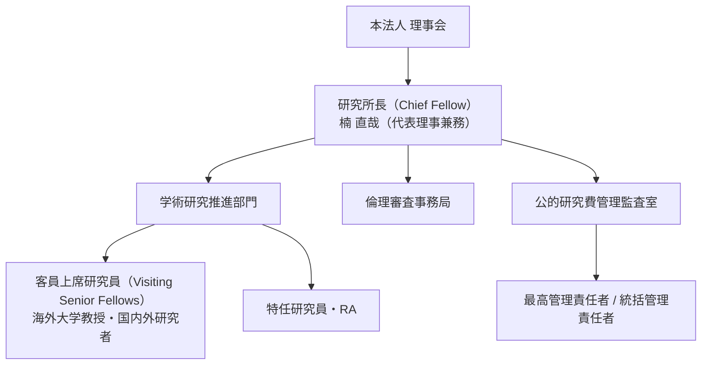
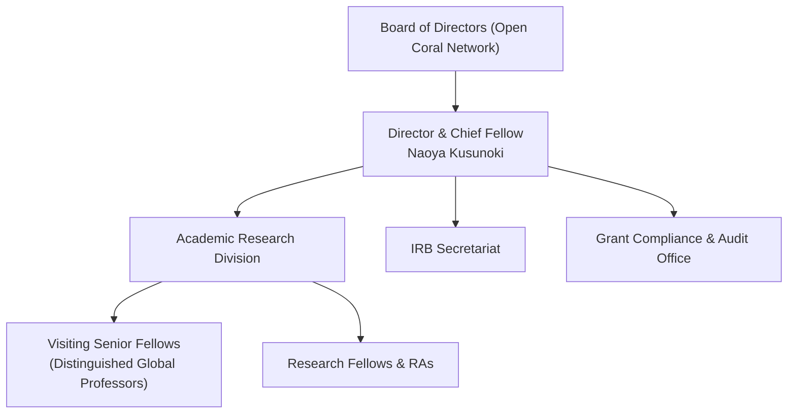

<Tabs>
  <Tab title="🇯🇵 日本語規程（Japanese Regulations）">
（令和8年9月16日 理事会決議 制定）

### 第1章 総則

#### 第1条（名称及び設置）
特定非営利活動法人 Open Coral Network（以下「本法人」という。）は、定款第3条に定める目的を学術的・実践的に高度に達成するため、本法人附置の恒常的研究機関として**「先端社会課題研究所」**（英語名称：Advanced Social Challenge Research Institute、略称：ASCRI。以下「本研究所」という。）を設置する。

#### 第2条（所在地）
本研究所の拠点は、本法人の富山活動拠点（富山市旧八尾町等）及び本部内に置き、実質的な研究活動および公的研究費管理・物品保管が可能な専用研究区画を確保する。

#### 第3条（研究目的）
本研究所は、以下の領域における理論的構築、実証分析、および社会実装研究を推進することを目的とする。
1. **多元的社会ガバナンス（Plurality）**: デジタル技術と市民協調による新しいコモンズの設計
2. **シビック・インテリジェンス（Civic AI）**: 自治体オープンデータとAIエージェントによる合意形成支援
3. **地域再生・コモンズ創出**: 空き家再生、多世代・多文化共生、地域循環型経済モデルの学術的検証

### 第2章 組織及び役職

#### 第4条（役職及び職務分掌）
本研究所に以下の役職を置く。
1. **研究所長（Chief Fellow）**:
   - 本研究所の代表者として、研究基本方針の策定、公的研究費の申請・受託の統括、対外学術連携を指揮する。
   - 初代研究所長には、本法人代表理事 **楠 直哉** が就任する。
2. **客員上席研究員（Visiting Senior Fellow）**:
   - 国内外の大学・研究機関に所属する卓越した教授・准教授等を招聘し、国際共同研究および論文共著を推進する。
3. **研究員・リサーチアシスタント（RA）**:
   - 各研究プロジェクトの実務、データ収集・解析、Typst等による論文組版、システム開発を担当する。

#### 第5条（エフォート規程及び職務範囲）
1. 研究所長は、本法人業務のうち**年間総実働時間の50%以上**を本研究所における学術研究活動、研究計画立案、および論文執筆等の研究本務に充てるものとする。
2. 研究活動に従事する常勤研究者の職務範囲は、本法人の事業執行業務と明確に区分し、研究日誌またはタイムシートにより研究エフォートの実態を担保する。
  </Tab>

  <Tab title="🇬🇧 English Charter (ASCRI Bylaws)">
*(Established by the Board of Directors on September 16, 2026)*

### Chapter 1: General Provisions

#### Article 1 (Name & Affiliation)
The Specified Nonprofit Corporation Open Coral Network hereby establishes the **Advanced Social Challenge Research Institute (ASCRI)** as its permanent internal academic research institution.

#### Article 2 (Headquarters & Laboratory)
ASCRI shall maintain physical research laboratory facilities in Toyama (Yatsuo-machi, Toyama City) and Tokyo, Japan, equipped with secure dedicated workstations and lockable equipment archives for public grant compliance.

#### Article 3 (Research Mandates)
ASCRI shall conduct theoretical research, empirical verification, and open implementations in:
1. **Plurality & Collaborative Governance**: Decentralized commons designs and digital democracy.
2. **Civic AI & Consensus Systems**: Open-data-driven AI agents facilitating municipal consensus.
3. **Regenerative Commons**: Vacant home revitalizations and regional circular economies.

### Chapter 2: Organization & Leadership

#### Article 4 (Officers & Responsibilities)
1. **Director & Chief Fellow**: Represents the Institute, formulates strategic research directions, and oversees competitive public grants. Founder **Naoya Kusunoki** is appointed as the inaugural Director.
2. **Visiting Senior Fellows**: Appointed from prestigious domestic and international universities (e.g., Sri Lanka) to lead international joint research.
3. **Research Assistants (RAs)**: Support quantitative data pipelines, Typst paper typesetting, and prototyping.

#### Article 5 (Research Effort Commitment)
1. The Director shall commit at least **50% of annual professional effort** directly to scientific inquiry, paper publication, and grant supervision.
2. Research duties shall remain strictly distinguished from nonprofit business operations via time-tracking systems.
  </Tab>
</Tabs>
