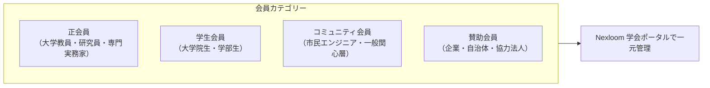

## 第1章 総則

### 第1条（名称）
本会は、**「多元的コモンズ学会」**（英語名称：Plural Commons Academic Society、略称：PCAS。以下「本学会」という。）と称する。

### 第2条（目的）
本学会は、AI協調型社会における新しいコモンズ（共有地）の設計、多元的ガバナンス（Plurality）、および自治体・市民・アカデミアが融合したシビックテクノロジーの実践知と学術理論を統合し、開かれた学術共同体として社会に寄与することを目的とする。

### 第3条（事業活動）
本学会は、前条の目的を達成するため、以下の事業を行う。
1. 年次学術シンポジウムおよび定期研究会の開催
2. 学会誌・紀要（学術論文集）の発行およびオープンアクセス公開
3. 内外の大学・学会・研究機関との学術交流および国際共同研究
4. 若手研究者・市民エンジニアの学術活動支援および表彰

---

## 第2章 会員制度

### 第4条（会員の種別及び権利）
1. **正会員**: 本学会の目的に賛同し、学術研究または高度な実践知を有する個人。総会における議決権、研究会での発表権、紀要への論文投稿権を有する。
2. **学生会員**: 大学、大学院、高等専門学校等に在籍する学生。論文発表権および大会参加費の割引優遇を受ける。
3. **コミュニティ会員**: 市民開発者、NPO実務者、一般参加者。会費無料で研究会・シンポジウムの傍聴およびオープンコミュニティ議論に参加できる。
4. **賛助会員**: 本学会の活動を財政的・実務的に支援する企業、団体、自治体。

### 第5条（会費体系）
| 会員種別 | 年会費 | 特典・権利 |
| :--- | :--- | :--- |
| **正会員** | 8,000円（初年度優待あり） | 論文投稿権、議決権、査読者資格、Nexloom研究ルーム |
| **学生会員** | 2,000円 | 論文投稿権、若手奨励賞エントリー資格、旅費補助公募 |
| **コミュニティ会員** | **無料（Free）** | 研究会オンライン傍聴、Discord/Nexloom交流 |
| **賛助会員** | 1口 50,000円（年） | 年次大会での事例発表枠、ロゴ掲載、特別セッション共催 |

---

## 第3章 役員及び運営機関

### 第6条（役員構成）
本学会に以下の役員を置く。
- 会長（1名）：学術方針の総括
- 副会長（1〜2名）：実務および国際連携の統括
- 幹事（若干名）：総務、財務、大会企画、広報、編集
- 監事（1名）：会計および会務の監査

### 第7条（プログラム委員会・編集委員会）
1. 研究会・年次大会における発表審査および学会誌論文の査読を行うため、独立した**「編集・プログラム委員会」**を設置する。
2. 査読の透明性と公平性を期すため、外部の大学教授・有識者を必ず査読者プールに過半数含めるものとする。

---

## 第4章 年次大会及び紀要

### 第8条（年次大会の開催）
本学会は、年1回以上、現地拠点（富山サードプレイス等）とオンライン配信を組み合わせた**「年次学術シンポジウム」**を開催する。

### 第9条（紀要のオープンアクセス方針）
本学会が発行する論文集・研究報告は、原則としてクリエイティブ・コモンズ表示（CC-BY 4.0）に基づき、**Zenodo および学会リポジトリを通じて即時オープンアクセス（無料公開・DOI付与）**とする。
