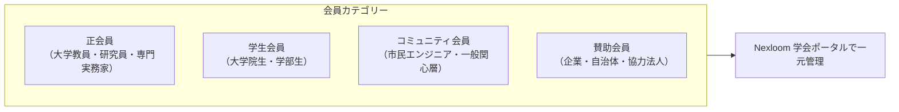

<Tabs>
  <Tab title="🇯🇵 日本語会則（Japanese Constitution）">
### 第1章 総則

#### 第1条（名称）
本会は、**「多元的コモンズ学会」**（英語名称：Plural Commons Academic Society、略称：PCAS。以下「本学会」という。）と称する。

#### 第2条（目的）
本学会は、AI協調型社会における新しいコモンズ（共有地）の設計、多元的ガバナンス（Plurality）、および自治体・市民・アカデミアが融合したシビックテクノロジーの実践知と学術理論を統合し、開かれた学術共同体として社会に寄与することを目的とする。

#### 第3条（事業活動）
本学会は、前条の目的を達成するため、以下の事業を行う。
1. 年次学術シンポジウムおよび定期研究会の開催
2. 学会誌・紀要（学術論文集）の発行およびオープンアクセス公開
3. 内外の大学・学会・研究機関との学術交流および国際共同研究
4. 若手研究者・市民エンジニアの学術活動支援および表彰

### 第2章 会員制度

#### 第4条（会費体系）
| 会員種別 | 年会費 | 特典・権利 |
| :--- | :--- | :--- |
| **正会員** | 8,000円 | 論文投稿権、総会議決権、査読者資格、Nexloom研究ルーム |
| **学生会員** | 2,000円 | 論文投稿権、若手奨励賞エントリー資格、旅費補助公募 |
| **コミュニティ会員** | **無料（Free）** | 研究会オンライン傍聴、コミュニティ議論への参加 |
| **賛助会員** | 1口 50,000円（年） | 年次大会での事例発表枠、ロゴ掲載、特別セッション共催 |
  </Tab>

  <Tab title="🇬🇧 English Constitution (PCAS)">
### Chapter 1: General Provisions

#### Article 1 (Official Name)
The Society shall be known as the **Plural Commons Academic Society** (abbreviated as **PCAS**).

#### Article 2 (Mission & Objectives)
The Society is dedicated to integrating academic theory and civic engineering practices in:
- **Plurality & Collective Governance** in the age of Artificial Intelligence.
- **Civic Artificial Intelligence** co-created with citizens and municipalities.
- **Sustainable Regional Commons** revitalizing local and digital communities.

#### Article 3 (Core Activities)
1. Hosting the Annual Academic Symposium and periodic research workshops (SIGs).
2. Publishing peer-reviewed conference proceedings and open-access journals.
3. Fostering cross-border academic alliances with international universities.
4. Mentoring and awarding young researchers and civic engineers.

### Chapter 2: Membership & Dues

| Category | Annual Dues | Privileges & Rights |
| :--- | :--- | :--- |
| **Regular Member** | JPY 8,000 | Paper submission, voting rights, reviewer eligibility, Nexloom suite |
| **Student Member** | JPY 2,000 | Paper submission, Young Scholar Award eligibility, travel grant access |
| **Community Member** | **Free (USD 0)** | Virtual session observer status, open forum access |
| **Supporting Sponsor** | JPY 50,000 / unit | Industry presentation slot, logo recognition, special tracks |
  </Tab>
</Tabs>
