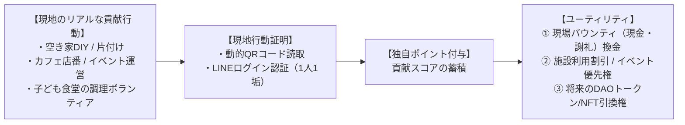

私たちは「善意のボランティアだから無償」という甘えを完全に排除します。  
獲得した外部資金（公金・外資）および実業売上から、現場のリアルな貢献に対して適正な対価（バウンティ・業務委託費・謝礼）を適法に支払います。

---

## 1. 職種別の報酬マトリクス

| 職種 / タスク | 主な業務内容 | 報酬体系 |
| :--- | :--- | :--- |
| **現場DIY・空間再生** | 空き家の片付け、壁塗り、大工、日常清掃 | 時間給 / タスク完了型バウンティ（即時支給） |
| **拠点ホスピタリティ** | カフェ店番、子ども食堂調理、ゲスト案内、宿泊受付 | シフト制報酬 ＋ 売上インセンティブ |
| **Civic AI & システム開発** | 助成金AI改修、自治体ダッシュボード構築、ツール連携 | スプリント報酬 / プロジェクト型業務委託費 |
| **政策プロポーザル起草** | 自治体課題分析、助成金申請書作成、行政折衝 | 案件ディレクション費 ＋ 採択インセンティブ |
| **クリエイティブ・アート** | 映像制作、展示空間キュレーション、作品プロデュース | 制作委託費 ＋ 作品売上レベニューシェア |

---

## 2. 独自ポイント制度と現地行動証明（Local Proof of Action）

将来的なDAOトークンやNFTへの昇格を見据え、日々の現場貢献を記録・蓄積する「独自ポイント」を運用しています。

### 不正（シビル攻撃）防止のローカライズ設計
- 地方住民に暗号資産や1ドル決済を強いると参加障壁が高くなります。
- 地域住民には**「LINE公式アカウント連携」＋「拠点現地に掲示された動的QRコード読取」**による現地行動証明を採用。
- 1人1アカウント・1日1回限定の現地チェックインにより、自作自演や遠隔からの水増し不正を完全に遮断しています。

---

## 3. 適法な利益分配（第一項有価証券該当性の回避）

<Warning>
  **金融商品取引法への完全準拠**  
  NFTやトークン自体に「保有するだけで自動的に現金配当が出る」仕組みは、金融商品取引法上の有価証券に該当し違法となるリスクがあります。  
  当組織における金銭還元は、すべて**「空き家DIY、清掃、開発、運営等に現実に従事したメンバーへの適法な業務委託費・活動謝礼（バウンティ）」**として支払われます。
</Warning>
