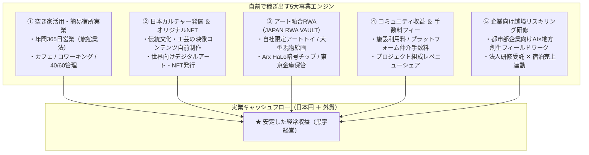

助成金や寄付金だけに依存する組織は、公募終了とともに活動が停止する脆弱性を抱えます。

Open Coral Network では、自前で生み出す**「強固な実業キャッシュフロー」**を確立し、外部環境に左右されない持続可能な経営基盤を構築しています。

---

## 1. 5大自社事業ポートフォリオ

---

## 2. 空き家活用 ＆ 空間再生事業

放置された空き家・古民家を再生し、リアルな経済活動の現場（サードプレイス）へ転換します。

* **簡易宿所営業（年間365日稼働）**:
  * 民泊（住宅宿泊事業法・年間180日上限）ではなく、旅館業法上の「簡易宿所」許可を取得。365日フル稼働で安定した宿泊料収入を創出。
* **40/60 キャパシティ管理**:
  * 会員優待枠を最大40%に抑え、**最低60%を一般客（Airbnb等）の現金売上枠として死守**することで、光熱費・リネン費・人件費を賄い確実に黒字化。
* **空き家等管理活用支援法人の指定取得**:
  * 改正空き家特措法に基づく自治体指定を受け、所有者相談の公的パイプラインを確立。再生・売却・利活用を組織内で完結。

---

## 3. 日本カルチャー発信 ＆ オリジナルコンテンツNFT

日本の地方に眠る伝統工芸、陶芸、現代美術、建築美を、クリエイティブの力で高品質なコンテンツ（映像・ドキュメンタリー・展示）として自前で制作・世界発信します。

* **多言語ナラティブ・コンテンツ**: YouTube、Note、海外メディア向けに、職人の技や地域の歴史を多言語で映像化。
* **オリジナルコンテンツNFT**: 世界中のデジタルノマドや海外コレクターへ向けて、ストーリーを宿したNFTを発行し、力強い外資（USD/ETH等）を獲得します。

---

## 4. アート融合実業プロダクト：JAPAN RWA VAULT

地域のアートや新進気鋭の日本人クリエイターと世界中のコレクターを直結する、次世代フィジカル・スタジオ ＆ 取引所 **「JAPAN RWA VAULT」** を自社事業として展開しています。

<CardGroup cols={2}>
  <Card 
    title="🏛️ JAPAN RWA VAULT 公式マーケット" 
    icon="vault" 
    href="https://coral-vault.com"
  >
    自社スタジオ限定アートトイ、直契約アーティストの大型現代アート、希少コレクティブルを自社金庫で保管し、NFTで即座に売買可能。
  </Card>

  <Card 
    title="📘 プロダクト仕様書を見る" 
    icon="file-lines" 
    href="/projects/japan-rwa-vault"
  >
    Arx HaLo暗号チップ真贋保証、東京セキュリティVault、DHL自宅出庫（Physical Claim）の技術仕様はこちら。
  </Card>
</CardGroup>

### 3つのコア・メカニズム
1. **100% 真正性保証（Arx HaLo暗号チップ）**:
   - 製造工程で作品へ暗号チップを不可逆埋め込み。スマートフォンをかざすだけで作品自身が暗号署名を発行し、本物を証明。
2. **東京セキュリティ金庫（Vault）預託**:
   - 高額な国際送料・関税・破損リスクをゼロにし、ブロックチェーン上で即座にP2P売買が可能。
3. **いつでも自宅へ配送（Physical Claim）**:
   - NFTをバーン（焼却）すれば、DHL Expressで世界中の自宅へ特注耐衝撃梱包でお届け。

---

## 5. コミュニティ収益 ＆ 手数料フィー

コミュニティインフラの提供に伴う適正なプラットフォーム手数料・利用料収入です。

* **施設利用料・コワーキング利用料**: 拠点のドロップイン利用、月額会員フィー、貸切イベント利用料。
* **マッチング ＆ ディレクションフィー**: 助成金申請支援、行政入札案件のディレクションフィー、成果報酬レベニューシェア。
* **二次流通ロイヤリティ**: アートRWAの売買手数料の一部が、作家および地域基金へ自動的に永続環流。

---

## 6. 企業向け越境リスキリング研修

都市部の大手・中堅企業向けに、形骸化した座学研修とは一線を画す**「先端AI実践 ✕ 地方課題フィールドワーク」**プログラムを有償提供します。

* **研修内容**: 地方の空き家拠点を舞台に、自社開発のCivic AIツールを駆使して現場課題を解決する実践型ワークショップ。
* **収益効果**: 研修受託費（1社あたり50万〜300万円）に加え、社員が拠点の簡易宿所に宿泊・滞在することでサードプレイスの実業収益にも直結します。

---

## 7. 法務ガバナンスと利益相反防止

<Warning>
  **NPO法人と実業プラットフォームのファイアウォール**  
  * NPO法人（非営利信託コモンズ基金）と、JAPAN RWA VAULT等の実業プラットフォーム（合同会社DAO等）との間には、NPO法第2条第2項（特別利益供与の禁止）に完全適合した**アームズ・レングス（市場価格）取引の原則**を適用しています。
  * すべての取引は理事会決議承認と正規の契約書に基づき運用され、公的助成金と実業収益の会計区分を厳格に分離しています。
</Warning>
