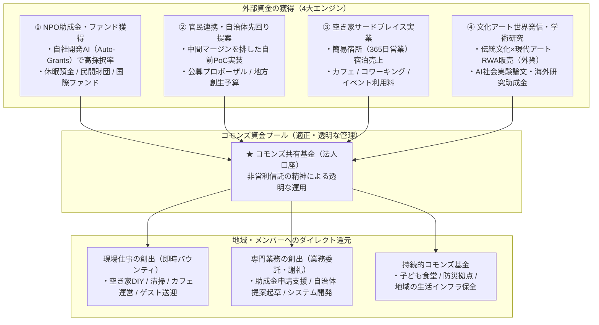

山古志村DAOをはじめとする先行事例では、「初期のNFT売上（約3,000万円）を切り崩して使い切る」「日常の定常キャッシュフローがない」「善意のボランティア疲れ」によって活動が失速しました。

本組織では、**「公的資金」「グローバル外資」「現場実業」を組み合わせた4大資金循環エンジン**を確立し、持続可能な富をコミュニティへ還元します。

---

## 1. 4大資金循環エンジン

<CardGroup cols={2}>
  <Card title="① NPO助成金・ファンド獲得" icon="file-invoice-dollar">
    自社開発AI（Auto-Grants）で全国の助成金公募を分析し採択率を最大化。休眠預金、日本財団、民間公益ファンドを継続獲得。
  </Card>

  <Card title="② 官民連携・自治体先回り提案" icon="building-flag">
    大手代理店の中抜きを排し、自治体課題へ「動くPoC」を逆提案。地方自治法第234条に適合した公募プロポーザルで公金を現場投入。
  </Card>

  <Card title="③ 空き家サードプレイス実業" icon="store">
    簡易宿所営業（年間365日）による宿泊料、カフェ、コワーキング利用料による、日々の安定した日本円現金売上。
  </Card>

  <Card title="④ 文化アート世界発信・学術研究" icon="earth-asia">
    伝統文化・現代アートRWAを世界市場へ販売し外貨を獲得。先端AIを用いたEBPM社会実験論文により海外助成金を獲得。
  </Card>
</CardGroup>

---

## 2. マーケティング ＆ 事業展開戦略

1. **助成金AIアプリ（Auto-Grants）の横展開**:
   - 資金調達に苦しむ地域のNPO・一般社団法人へSaaSおよび伴走支援を提供。
2. **自治体入札・公募プロポーザル攻略**:
   - 空き家対策、孤独孤立対策、地域DXの公募プロポーザルに積極応札。
3. **企業向け越境リスキリング研修**:
   - 都市部企業向けに「先端AI実践 ✕ 地方創生フィールドワーク」の研修プログラムを有償提供。
4. **空き家等管理活用支援法人の指定取得**:
   - 改正空き家特措法に基づく自治体指定を受け、空き家所有者相談の公的パイプラインを確立。
