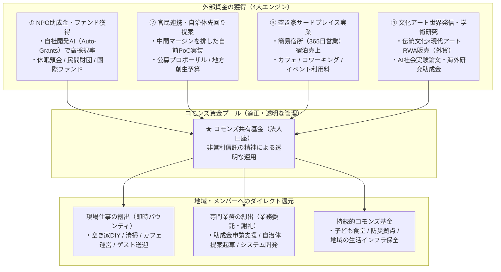
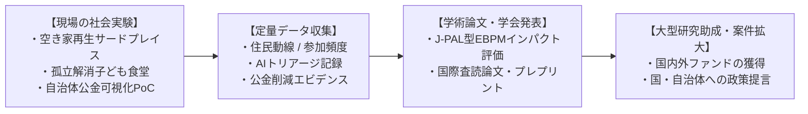
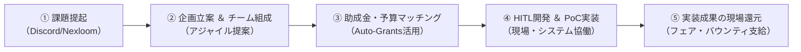

山古志村DAOをはじめとする先行事例では、「初期のNFT売上（約3,000万円）を切り崩して使い切る」「日常の定常キャッシュフローがない」「善意のボランティア疲れ」によって活動が失速しました。

本組織では、**「公的資金」「グローバル外資」「現場実業」を組み合わせた4大資金循環エンジン**を確立し、コミュニティの共創と共同研究アライアンスによって持続可能な富を地域へ還元します。

---

## 1. 4大資金循環エンジン

<CardGroup cols={2}>
  <Card title="① NPO助成金・ファンド獲得" icon="file-invoice-dollar">
    自社開発AI（Auto-Grants）で全国の助成金公募を分析し採択率を最大化。休眠預金、日本財団、民間公益ファンドを継続獲得。
  </Card>

  <Card title="② 官民連携・自治体先回り提案" icon="building-flag">
    大手代理店の中抜きを排し、自治体課題へ「動くPoC」を逆提案。地方自治法第234条に適合した公募プロポーザルで公金を現場投入。
  </Card>

  <Card title="③ 空き家サードプレイス実業" icon="store">
    簡易宿所営業（年間365日）による宿泊料、カフェ、コワーキング利用料による、日々の安定した日本円現金売上。
  </Card>

  <Card title="④ 文化アート世界発信・学術研究" icon="earth-asia">
    伝統文化・現代アートRWAを世界市場へ販売し外貨を獲得。先端AIを用いたEBPM社会実験論文により海外助成金を獲得。
  </Card>
</CardGroup>

---

## 2. 共同研究アプローチ ＆ EBPM社会実験

私たちは単なる受託開発や地域イベントの主催にとどまらず、**「最先端AIとシビックイノベーションの実践ラボ」**として、学術研究アプローチをエコシステムの中心に据えています。

* **EBPM（根拠に基づく政策形成）**: 先端AIを用いて地域の社会課題データ・活動ログを定量分析し、学術論文として発表。
* **オープンソース（OSS）共有**: 開発したシビックテックツールや分析プロンプトはオープンソースで公開し、全国のエンジニア・研究者と協働します。

---

## 3. 大学・研究機関・NFO連携による規模拡大

地域の小さなNPO単独では応募できない大型コンソーシアム案件や国公私立大学との共同公募にも、積極的なアライアンスを組んでアプローチします。

| 連携パートナー | 主な協働内容 | 獲得を目指す案件・助成金規模 |
| :--- | :--- | :--- |
| **大学・学術研究機関** | 共同研究契約、社会実験フィールド提供、客員研究員受け入れ | 科研費、JST（科学技術振興機構）、NEDO等の大型研究開発予算（1,000万〜5,000万円） |
| **公益財団・NFO（非営利資金提供組織）** | 休眠預金活用事業の資金分配団体・実行団体連携、社会課題調査委託 | 休眠預金等交付金、日本財団助成金（2,000万〜1億円規模のコンソーシアム） |
| **先端AI・Tech企業** | GPUリソース提供、実証PoC共同開発、エンジニア派遣 | 共同受託コンソーシアム、企業版ふるさと納税、産学官連携ファンド |

---

## 4. グローバルWeb3助成金から地方自治体案件まで

エコシステムが獲得対象とする資金は、超ローカルな自治体予算からグローバルな分散型ファンドまでシームレスに広がっています。

<CardGroup cols={2}>
  <Card title="🌐 グローバルWeb3グラント" icon="network-wired">
    Gitcoin Grants、Optimism RetroPGF、Arbitrum Foundation等の公共財（Public Goods）助成金に応募。世界中のクリプトコミュニティからUSD/ETH建ての資金を獲得。
  </Card>

  <Card title="🏛️ 国・自治体公募プロポーザル" icon="building-columns">
    空き家対策、孤独・孤立防止、デジタル田園都市国家構想交付金などの公募型プロポーザル。動くPoCと地域密着の強みで高採択率を実現。
  </Card>
</CardGroup>

---

## 5. コミュニティ協働パイプライン（企画から実装まで）

Open Coral Network では、上意下達のトップダウンではなく、コミュニティの自発的なアイデアから事業化・現場実装までを一連のパイプラインで伴走支援します。

コミュニティメンバー全員が「企画者」「開発者」「現場プレイヤー」として参画し、創出された成果と報酬をフェアに分かち合います。
