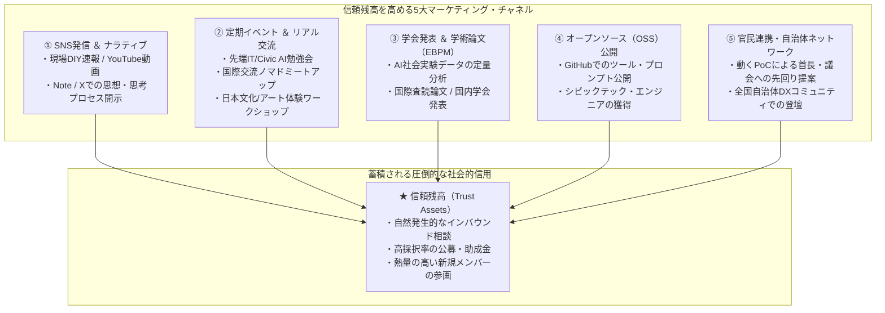

Open Coral Network では、多額のペイド広告（Web広告・チラシ配布）に依存する旧来型の集客を行いません。

私たちは、**「現場の一次情報」「学術的エビデンス」「オープンソースによる価値提供」**を通じてコミュニティの内外に圧倒的な信頼残高を築く、**「シビック・マーケティング（多角的PR）」**を展開しています。

---

## 1. シビック・マーケティングの5大チャネル

---

## 2. SNS発信 ＆ ナラティブ・ストーリーテリング

* **「結果」だけでなく「プロセス」を全公開する**:
  * 空き家の片付けのビフォーアフター、DIYの失敗談、AIプロンプトのチューニング試行錯誤など、生々しい一次情報をリアルタイムに発信します。
* **プラットフォームごとの役割分担**:
  * **X (旧Twitter)**: 日常の現場速報、最新AIトレンドの考察、勉強会告知。
  * **Note / ブログ**: 組織の哲学、課題提起、制度改革の長文ナラティブ。
  * **YouTube / ショート動画**: 古民家リノベーションのタイムラプス、職人ドキュメンタリー、アート作品制作過程。

---

## 3. 定期イベント ＆ 現場コミュニティの創出

空き家サードプレイスを拠点とし、オンライン（Discord / LiveKit）とオフラインを融合させた定期イベントを開催しています。

<CardGroup cols={3}>
  <Card title="💻 先端IT・Civic AI 勉強会" icon="microchip">
    自社開発の助成金AIアプリやLLMエージェントを実際に動かしながら、地方にいながら最先端のAI技術を共同学習するハンズオン。
  </Card>

  <Card title="🌏 国際交流ノマドミートアップ" icon="earth-americas">
    滞在中の外国人デジタルノマドやバックパッカーを囲み、英語と日本語を交えて地域の未来を語り合うインバウンド交流イベント。
  </Card>

  <Card title="🍵 日本文化 ＆ アートワークショップ" icon="palette">
    地域の陶芸・漆器職人やアーティストを招いた作品制作体験、郷土料理とお酒を楽しむ多世代交流ディナー。
  </Card>
</CardGroup>

---

## 4. 学会・研究会発表 ＆ 学術論文（EBPM）

単なる「市民団体のイベント」で終わらせず、社会課題解決のプロセスを学術研究（EBPM: 根拠に基づく政策形成）として体系化します。

* **J-PAL型インパクト評価**:
  * 空き家再生や子ども食堂、公金透明化PoCが地域に与えた社会的・経済的インパクトを定量測定。
* **国際プレプリント ＆ 学術論文の発表**:
  * 大学や研究機関と連名で学術論文を執筆・公開。自治体や国に対する政策提言の強力な客観的裏付け（エビデンス）となります。

---

## 5. オープンソース（OSS）公開 ＆ 官民連携

* **シビックテックツールのOSS公開**:
  * 自治体財政可視化（Zaisei Radar）や助成金マッチングプロンプトをGitHub上でオープンソース公開。全国のエンジニアが自然にコントリビュートするインバウンド導線をつくります。
* **官民連携・先回り提案（リバースプロポーザル）**:
  * 自治体の課題に対して、既存の大手ベンダーが数千万円で見積もるシステムを「動くプロトタイプ」として無償公開・先回り提案。首長や担当課長との直接対話を通じて、真に必要な入札・公募案件を創出します。
