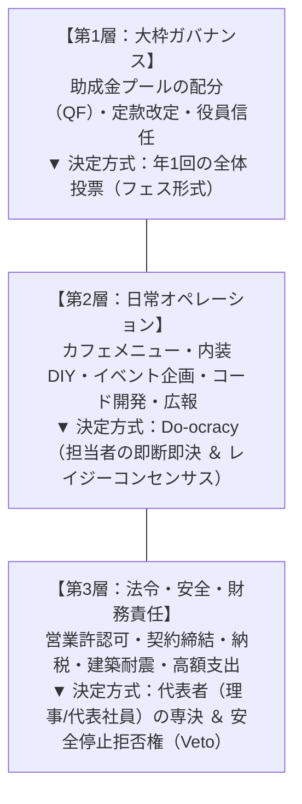
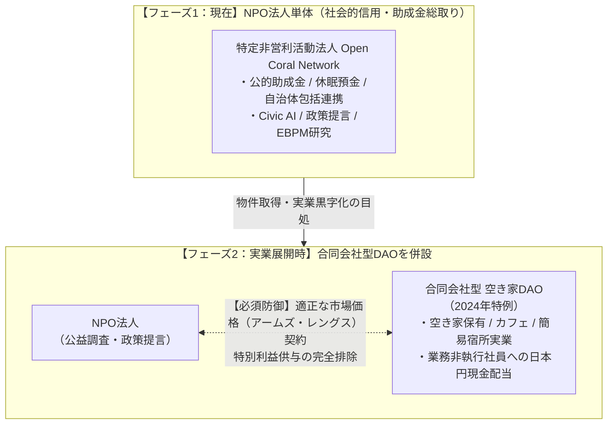

従来の組織やDAOにありがちな「すべての決定を会議や全員投票にかける」アプローチは、決定スピードの麻痺とメンバーの「投票疲れ（Voter Fatigue）」を招き、自滅します。

当法人では、台湾g0v（ガブゼロ）が実証した**「Do-ocracy（行動主義：行動する者が決める）」**を取り入れ、権限と責任を3つのレイヤーに明確に分離しています。

---

## 1. ガバナンス意思決定の3層分離ルール

| 階層 | 主な決定事項 | 決定方式 | 実施頻度 |
| :--- | :--- | :--- | :--- |
| **第1層：大枠ガバナンス** | 助成金プール配分、定款改定、コアメンバー信任 | **全体投票（年1回フェス）** | 年 1 回 |
| **第2層：日常オペレーション** | カフェメニュー、内装DIY、イベント企画、コード開発、広報 | **Do-ocracy（実行者が即決）** | 365日随時 |
| **第3層：法令・安全責任** | 営業許認可、契約締結、納税、建築耐震、安全管理 | **代表理事/代表社員の専決** | 随時 |

---

## 2. Do-ocracyを支える2大安全ガードレール

実行者の自律性を最大限に尊重しつつ、組織の暴走や法令違反を防ぐためのセーフティネットを設けています。

### ① レイジー・コンセンサス（Lazy Consensus）
日常の企画や改善アイデアは、DiscordやSlackの公開チャンネルで事前に共有します。
* **「3営業日以内に強い異論が出なければ自動承認（実行OK）」**とします。
* 「全員の賛成を待つ」のではなく、「強い反論がなければ直ちに行動する」ことで、承認待ちによるスタックを完全に排除します。

### ② 代表者の安全停止拒否権（Veto）
以下の重要事項については、法的な損害賠償責任を負う代表理事が即時に拒否権（Veto）を発動できます：
1. **建物の耐震・構造に関わる解体や工事**
2. **保健所・消防法令に関わる食品衛生・宿泊設備**
3. **3万円以上の単一支出および対外契約**

---

## 3. 法人構造：NPO ✕ 合同会社型DAOの二刀流スキーム

行政との包括連携や助成金受託に必要な「公的信用力」と、空き家サードプレイス実業での「迅速な投資・収益配当」を両立するため、2段階の法人構造を採用しています。

<Warning>
  **利益相反防止ファイアウォール（法務防護条項）**  
  * **特別利益供与の禁止（NPO法第2条第2項）**: NPO法人が得た公金や助成金を、営利企業である合同会社DAOへ無償移転・贈与することは厳禁です。
  * **アームズ・レングス（市場価格）取引の原則**: NPOと合同会社間の取引（例: サードプレイスの施設利用料、調査委託費）は、第三者間と同様の市場価格による正式な契約書を締結し、NPO理事会での承認議事録を残します。
</Warning>
