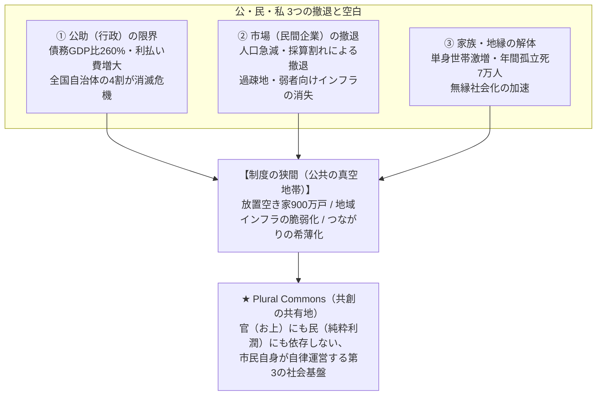

<Warning>
  **【第一原則】「個人のための組織」から「組織のための個人」へ**  
  当法人は、個人の利己的な権利主張や、一過性の公金消化イベントのための集まりではありません。私たちは、日本の構造的危機に立ち向かい、市民・当事者が自律的な社会共通資本（コモンズ）を守り育てるために、一人ひとりが主体的に組織のミッションにコミットする実践共同体です。
</Warning>

---

## 1. 私たちが対峙する日本の5大構造危機

いま日本社会は、「公助（行政）」と「市場（民間企業）」が同時に周縁部から撤退する重大な構造転換期（公共の真空地帯）を迎えています。



1. **政治・行政のブラックボックス**:
   - 官公庁IT調達の98.9%が既存ベンダーに固定され、再契約理由の約半分が「役所側がシステム内容を把握していないため」というブラックボックス状態。市民不在のまま高額な税金が中間マージンに消えています。
2. **失われた30年の経済停滞**:
   - 実質賃金の低下、自律的イノベーションの欠如、中間搾取による地域からの富の流出。
3. **少子化・単身化・無縁社会**:
   - 年間7万人の孤立死、昭和型家族モデル・終身雇用の解体、セーフティネットの崩壊。
4. **消滅可能性自治体の激増**:
   - 全国の約4割の自治体が存続危機。税収激減と社会保障費増大による財政破綻の危機。
5. **コミュニティの希薄化と空き家900万戸**:
   - 放置される膨大な遊休不動産と、人々が心を通わせ挑戦できる「サードプレイス（第3の居場所）」の喪失。

---

## 2. 解決のアプローチ：Civic AI × サードプレイス × 新しいコモンズ

私たちは、旧来の共同体の同調圧力や、純粋な市場資本主義の拝金主義から脱却し、**「テクノロジーと相互扶助が融合した第3の道（自律型コモンズ）」**を切り拓きます。

```
【旧来の共同体（村社会）】       【資本主義の限界（市場原理）】
  ❌ 閉鎖的・同調圧力             ❌ 採算割れ地域からの容赦ない撤退
  ❌ 寄り合い等の過重負担         ❌ 拝金主義・短期利益至上
                 ＼             ／
             ★ 【新しいコモンズ（共有地）】 ★
             ⭕ オープン＆ボーダレス（出入り自由）
             ⭕ バックオフィス・ゼロ（AIによる自動化）
             ⭕ 貢献の可視化とフェアな還元
```

<CardGroup cols={3}>
  <Card title="Civic AI & GovTech" icon="brain">
    台湾g0vやオードリー・タンの思想を導入。公金・財政データを可視化（Zaisei Radar）し、市民発の動くプロトタイプで行政を先導。
  </Card>

  <Card title="空き家サードプレイス" icon="house">
    900万戸の空き家・古民家をアトリエ、多世代食堂、コワーキング、簡易宿所として再生。オンラインとオフラインを融合。
  </Card>

  <Card title="DAO & コモンズ経済" icon="coins">
    利益を外部株主へ流出させず、現場で汗を流したメンバーと地域基金へ還元する自律分散型経済圏。
  </Card>
</CardGroup>

---

## 3. 文化・アートの世界発信

日本の地方に眠る伝統工芸、陶芸、現代美術、建築美を、クリエイティブの力で高品質なコンテンツ（映像・ドキュメンタリー・展示）として自前で制作・世界発信します。

国内の縮小する円経済だけに依存せず、海外のコレクターやデジタルノマドから**力強い外資（外貨）を獲得**し、地域コミュニティとアーティストへ直接環流させます。
