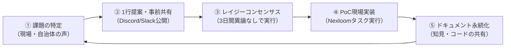

Open Coral Network では、上司の指示を待つのではなく、メンバー一人ひとりが課題を発見し、自律的にスプリントを回してプロジェクトを推進します。

---

## 1. アジャイル・スプリントのサイクル

---

## 2. 成果物の残し方（Writeback原則）

活動の知見や成果物は、個人のローカルやチャットの流れるログに放置せず、必ず以下の場所に永続化してください。

| 成果物の種類 | 格納場所 |
| :--- | :--- |
| **公式決定事項・仕様書** | [Nexloom Wiki ページ](https://ai-note-meet.vercel.app) または 本ハンドブック |
| **タスク進捗・ToDo** | [Nexloom タスクボード](https://ai-note-meet.vercel.app) |
| **定例ミーティング議事録** | Nexloom AIミーティング記録（自動生成・タスク連動） |
| **ソースコード・システム** | [GitHub リポジトリ](https://github.com/t012093/plural-commons-japan) |
| **各種申請・台帳** | Notion 共有ワークスペース |
