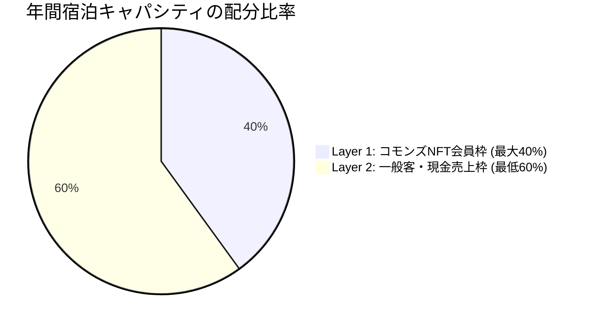

当法人では、全国で放置される空き家・古民家を**「オンラインとオフラインが融合するコミュニティ共有地（サードプレイス）」**としてリノベーションし、日常的な交流・制作・ワーケーション拠点として再生・運営しています。

---

## 1. 拠点の多目的機能

各サードプレイス拠点は、時間帯や曜日によって多様な表情を持ちます。

* **1階 コミュニティラウンジ ＆ カフェ**:
  * 昼間は近隣住民や子どもたちが集う「子ども食堂」「多世代サロン」。
  * 週末は地域のお茶会や、手仕事・アートのワークショップを開催。
* **コワーキング ＆ アトリエスペース**:
  * 高速Wi-Fi・電源完備。デジタルノマド、エンジニア、アーティストが滞在制作できるオープンスタジオ。
* **簡易宿所（宿泊・ワーケーション）**:
  * 旅館業法に基づく「簡易宿所営業（年間365日稼働）」の許可を取得。
  * 国内外からの旅人やワーケーション客を受け入れ、日々の定常実業キャッシュフローを生み出します。

---

## 2. 宿泊予約と「40/60 キャパシティ管理ルール」

先行する山古志村DAOの反省点（会員の無料宿泊枠で日数が枯渇し、リネン費・光熱費で赤字になる構造）を克服するため、厳格なキャパシティ管理を行っています。

<Warning>
  **原価防衛と実業キャッシュフローの死守**  
  * **Layer 1（会員優待枠）**: 年間総提供日数の**最大40%**に制限。繁忙期（GW・お盆・年末年始）は除外日（ブラックアウト）を設定。
  * **Layer 2（一般客枠）**: **最低60%は必ずAirbnb等の一般客の現金売上枠として確保**し、日々の光熱費・維持費・現場スタッフへの人件費を賄う黒字構造を維持します。
</Warning>

---

## 3. 定期イベント ＆ 国際交流・先端ITの学びの場

空き家サードプレイスは、ただの作業場ではなく**「国境と世代を超えて知と文化が交差するオープンラボ」**です。オンライン（Discord / LiveKit）とオフライン拠点を繋ぎ、定期イベントを開催しています。

<CardGroup cols={3}>
  <Card title="💻 先端IT・Civic AI 勉強会" icon="microchip">
    LLM、プロンプト設計、自律エージェント、オープンソース開発の実践ハンズオン。地方にいながら最先端のAI技術を共同学習。
  </Card>

  <Card title="🌏 国際交流 ＆ ノマドミートアップ" icon="earth-americas">
    海外からのデジタルノマド、研究者、バックパッカーを歓迎するインバウンド交流会。英語・日本語での文化対話。
  </Card>

  <Card title="🍵 日本文化 ＆ アートワークショップ" icon="palette">
    地域の陶芸・漆器・木工の職人やアーティストを講師に招いた体験会、日本酒・郷土料理のシェアディナー。
  </Card>
</CardGroup>

---

## 4. 現地利用の心得とマナー

1. **みんなで守るコモンズ**:
   - 使った場所の片付け・ゴミの分別・簡単な掃除は、利用者全員が主体的に行います。
2. **地域住民への配慮**:
   - 夜間（21時以降）の騒音防止、指定場所以外での駐車禁止など、地域コミュニティとの調和を最優先します。
3. **安全管理**:
   - 火の元の確認、退室時の施錠を徹底してください。破損や異常を発見した際は直ちに現場担当者へ報告してください。
