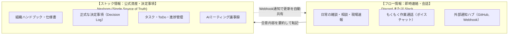

私たちのチームでは、「チャットの激流で重要事項が流れて消える」「複数アプリを行き来して疲弊する」という問題を避けるため、**「Nexloom」と「Discord/Slack」の役割を明確に切り分けたハイブリッド運用**を行います。

---

## 1. 役割分担マトリクス

| 区分 | 📘 Nexloom | 💬 Discord / Slack |
| :--- | :--- | :--- |
| **主な用途** | **ナレッジ・決定事項・タスク・AI議事録** | **日常チャット・即時連絡・雑談・作業通話** |
| **情報の性質** | **ストック（恒久的に残すべき公式情報）** | **フロー（流れて消えても困らない情報）** |
| **強み** | ページ、タスク、会議録、AIが1か所に繋がる | 即時プッシュ通知、スマホ最適化、ボイス通話 |
| **具体例** | 組織ハンドブック改訂、タスク進捗、議事録 | 「今向かってます！」「これどう思う？」「作業部屋入ります」 |
| **原則** | **「ここで合意・記録されたものが公式の真実」** | **「決定事項は必ずNexloomへ記録する」** |

---

## 2. アプリ横断ストレスを減らす3大ルール

<CardGroup cols={3}>
  <Card title="① チャットの決定は1行でNexloomへ" icon="pen-to-square">
    SlackやDiscordで議論して決まったことは、Nexloomの該当ページやタスクに1行で記録し、リンクをチャットに貼ります。
  </Card>

  <Card title="② Webhook連携で更新を見落とさない" icon="bell">
    Nexloomの更新通知はDiscord/Slackの特定チャンネルに自動連携。普段のチャットを見ていれば見落としません。
  </Card>

  <Card title="③ タスクや議事録は直接Nexloomで" icon="list-check">
    誰が何をいつまでにやるかは、チャットではなく最初からNexloomのタスクボード・会議録機能で作成します。
  </Card>
</CardGroup>
