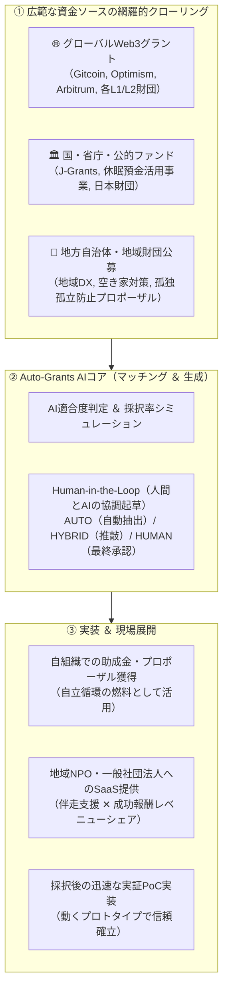

資金調達と書類作成の過重な負担は、全国のNPOやシビックテック組織が直面する最大のボトルネックです。

当組織が開発・運用する**「Auto-Grants（助成金AI自動申請基盤）」**は、Web上に散在するあらゆる助成金情報をリアルタイムに収集・分析し、企画立案から人間とAIの協調（HITL）による申請書作成、採択後の実証PoC実装までをエンドツーエンドで支援します。

---

## 1. システム概要と3層アーキテクチャ

---

## 2. 4大コア機能

<CardGroup cols={2}>
  <Card title="自動クローリング ＆ 採択率予測" icon="robot">
    省庁API（J-Grants）、自治体HP、Web3フォーラムを常時走査。公募要領PDFをOCR解析し、団体の実績・規約との適合度スコア（0〜100%）と採択率を予測。
  </Card>

  <Card title="HITL（Human-in-the-Loop）申請書生成" icon="user-gear">
    AIが下書きを一発生成するだけでなく、専門ディレクターと現場メンバーが共同推敲できる3段階トリアージ（AUTO / HYBRID / HUMAN）ワークフローを完備。
  </Card>

  <Card title="予算積算 ＆ 経費キーワード検証" icon="calculator">
    助成金固有の対象外経費（使途制限）をAIが自動検知。人件費・謝金・旅費・備品費の適正な配分グラフを自動計算。
  </Card>

  <Card title="採択後PoC ＆ タスクボード連動" icon="diagram-project">
    採択された提案書のAction Itemsを、NexloomやGitHubのタスクボードへ即時チケット化。公金監査に耐えうる活動エビデンスを自動蓄積。
  </Card>
</CardGroup>

---

## 3. 展開モデル：自社活用 ✕ NPO横展開

Auto-Grants は、自組織の資金調達ツールであると同時に、全国の市民活動セクターをエンパワーするSaaS事業です。

1. **自社での徹底活用（実証と改善）**:
   - まずOpen Coral Network自身の助成金獲得・プロポーザル応札でフル稼働させ、採択のトラックレコード（実績）を積み上げます。
2. **地域NPO・一般社団法人へのプラットフォーム提供**:
   - 専任のファンドレイザーがいない地域のNPOや社団法人へ、月額利用料＋採択成功報酬のモデルで提供。申請書の代行ではなく、団体の伴走支援者として共に公金を獲得します。
3. **大学・研究機関コンソーシアムの組成**:
   - 各種助成金・共同研究の公募要件に合わせて、大学研究室や企業と瞬時にコンソーシアムを組成できるアライアンス・マッチング機能を順次実装しています。

---

## 4. 内部仕様書 ＆ システム連携

* **UI設計仕様書**: [`specs/grant_proposal_ui_spec.md`](file:///Users/2005nk/Works/ai-note-meet-mac/specs/grant_proposal_ui_spec.md)（Nexloom Light Clean UI 完全統合設計）
* **MCPバックエンド連携**: ローカルおよびクラウドで稼働する `auto-grants-local` MCPサーバー（150種超の助成金専用ツール群）と直接連携可能。
