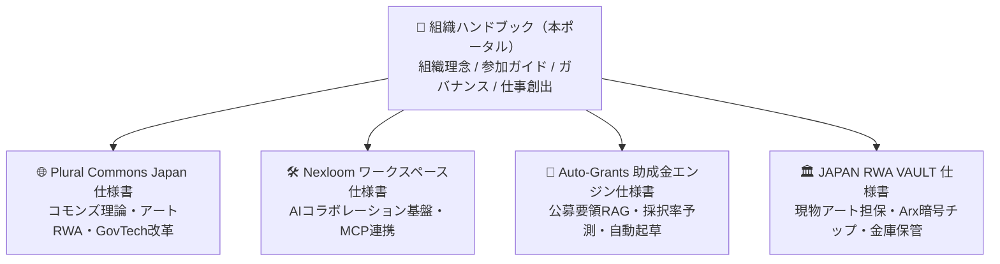

当法人が開発・運営している中核プロジェクトの技術仕様書、政策提言書、システム設計ドキュメントへのリンク集です。

ハンドブック（本サイト）で組織全体のルールや参加方法を把握した上で、各プロジェクトの具体的なシステム設計や実装詳細については、以下の各専用ドキュメントをご参照ください。

---

## 🚀 進行中の公式プロジェクト

<CardGroup cols={2}>
  <Card 
    title="🌐 Plural Commons Japan" 
    icon="network-wired" 
    href="/projects/plural-commons"
  >
    4大コモンズ構想（空間・居場所・文化・資金）、アートRWA真贋認証・トークノミクス、Zaisei Radar、自治体IT調達改革の完全仕様書。
  </Card>

  <Card 
    title="🛠️ Nexloom 統合ワークスペース" 
    icon="cube" 
    href="/projects/nexloom-workspace"
  >
    チャット、ドキュメント、タスク、LiveKit AI議事録、60種超のリモートMCP（Model Context Protocol）を一体化したワークスペース基盤。
  </Card>

  <Card 
    title="🤖 Auto-Grants（助成金AIアプリ）" 
    icon="robot" 
    href="/projects/auto-grants"
  >
    Web3グラントから地方自治体公募までを網羅し、AIマッチング・HITL申請書起草・採択後PoC実装を一気通貫で支援する基盤仕様書。
  </Card>

  <Card 
    title="🏛️ JAPAN RWA VAULT" 
    icon="vault" 
    href="/projects/japan-rwa-vault"
  >
    自社スタジオ限定アートトイ、直契約アーティストの大型現代アート、Arx HaLo暗号真贋保証、東京セキュリティ金庫保管・物理出庫の仕様書。
  </Card>
</CardGroup>

---

## 💡 プロジェクト仕様書の役割

