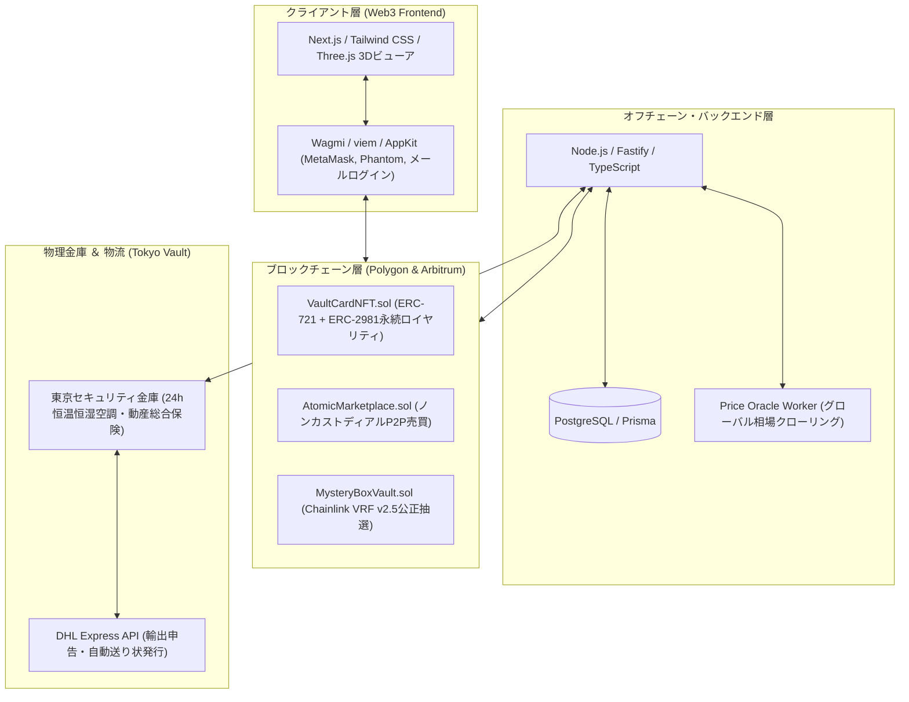

日本の優れたクリエイターや伝統的職人技が、地理的・言語的な壁によって正当なグローバル評価と対価を得られていない構造課題を解決するため、自社事業として**「JAPAN RWA VAULT（現物資産担保型スタジオ ＆ 取引所）」**を展開しています。

<Frame caption="JAPAN RWA VAULT: 自社スタジオ製造 ✕ 東京セキュリティ金庫 ✕ グローバルNFT即時売買">
  
</Frame>

---

## 1. 3分でわかる JAPAN RWA VAULT

JAPAN RWA VAULTは、世界中のコレクターと日本のクリエイターを直結する**「自社スタジオ ＆ 現物裏付け型Web3コレクション金庫」**です。

新進気鋭の日本人アーティストを発掘・直契約し、自社スタジオで企画・製造された**「世界限定のアートトイ・フィギュア」や「大型現物絵画」**を中心に展開しています。

すべての作品は東京の自社セキュリティ金庫（Vault）で安全に保管され、ブロックチェーン上のNFTとして**国際送料・関税・破損リスクゼロで即座にP2P売買**が可能です。

---

## 2. 3大コア・メカニズム

<CardGroup cols={3}>
  <Card title="自社スタジオ限定プロダクト" icon="palette">
    自社直契約アーティストによる限定アートトイ、1点物キャンバス、特注版画など、ここでしか手に入らない作品を直接Drop。
  </Card>

  <Card title="100% 真正性保証" icon="shield-check">
    製造工程でArx HaLo暗号チップを不可逆埋め込み。スマホをかざすだけで作品自身が暗号署名を発行し、本物を証明。
  </Card>

  <Card title="いつでも自宅へ配送" icon="truck-fast">
    NFTをバーン（焼却）すれば、DHL Expressで世界中のご自宅へ特注耐衝撃梱包でお届け（Physical Claim）。
  </Card>
</CardGroup>

---

## 3. システムアーキテクチャ

フロントエンド、スマートコントラクト、物理金庫、物流APIが疎結合に連携するハイブリッドWeb3構成です。

---

## 4. 取扱アセットカテゴリー

1. **自社限定アートトイ・フィギュア**: 作家のオリジナルキャラクターを自社で3Dスカルプト・限定製造（Arxチップ内蔵）。
2. **現代アート大型作品**: アーティスト直契約による大型原画絵画（Verisart鑑定書・永続ロイヤリティ付き）。
3. **厳選コレクティブル**: PSA10鑑定カード、シュリンク付き未開封BOX。

---

## 5. 公式リンク ＆ ドキュメント案内

プロダクト本体および公式コミュニティへは、以下のリンクからアクセスいただけます：

<CardGroup cols={2}>
  <Card 
    title="🚀 マーケットプレイス" 
    icon="store" 
    href="https://coral-vault.com"
  >
    作品の閲覧、オンチェーン購入、Vault預託一覧はこちら。
  </Card>

  <Card 
    title="📱 Web3 アプリケーション" 
    icon="mobile" 
    href="https://coral-vault.com/app"
  >
    ウォレット接続、コレクション管理、出庫（Physical Claim）手続き。
  </Card>

  <Card 
    title="🌐 公式 X (旧Twitter)" 
    icon="x-twitter" 
    href="https://x.com/JapanRwaVault"
  >
    最新の限定ドロップ情報、作家コラボ告知、スタジオ進捗。
  </Card>

  <Card 
    title="💬 コミュニティ Discord" 
    icon="discord" 
    href="https://discord.gg/japan-rwa-vault"
  >
    世界中のコレクター、アーティスト、DAOコントリビューターの交流ラウンジ。
  </Card>
</CardGroup>

* **独立仕様書ドキュメント**: 本プロジェクトの完全な仕様書は、専用 Mintlify ドキュメント（`coral-shop/docs-mintlify`）として独立管理・公開されます。
